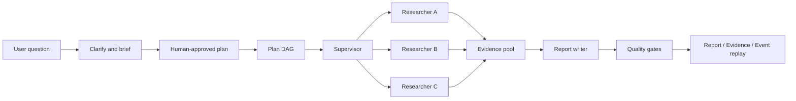
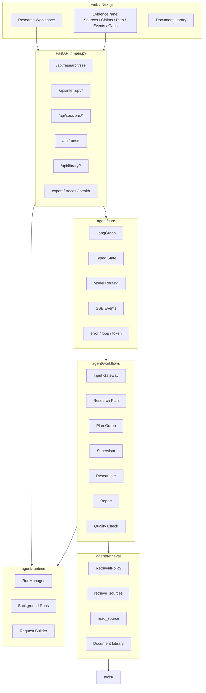
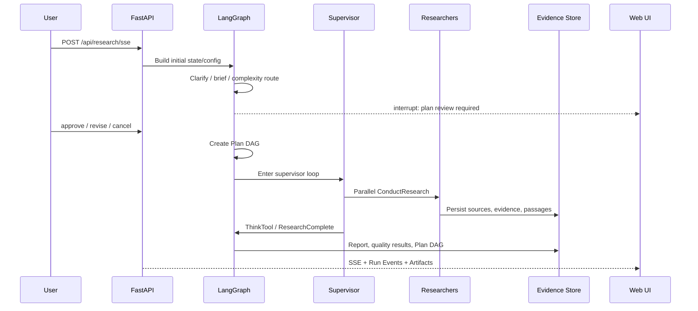
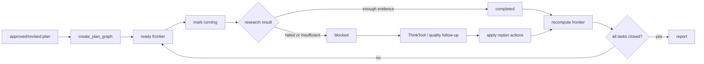
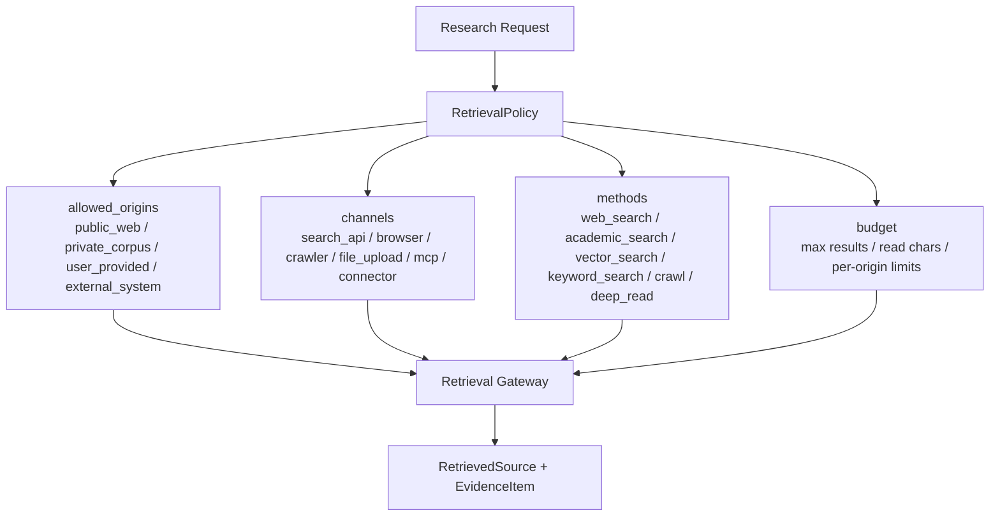
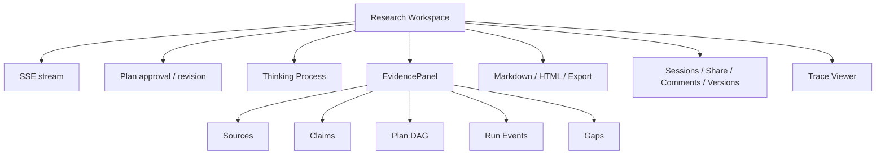

# SoulSearcher

[中文](README.md) | Default README: Chinese

SoulSearcher is a LangGraph-based deep research agent platform. It turns open-ended questions into auditable research runs: clarify the request, create a research brief, pause for plan approval, execute a Plan DAG, coordinate parallel researchers, collect evidence, write the report, run quality checks, and expose the full process through SSE, Evidence Panel, and Run Events.


## In One Sentence

SoulSearcher is not a one-shot chatbot and not just RAG. It is a **Workflow + Agent** system for complex research: deterministic steps are controlled by code, open-ended exploration is handled by models and tools, and every important state transition is recorded.



## Core Capabilities

| Area | Current Implementation |
| --- | --- |
| Explicit workflow | `clarify -> brief -> classify -> plan -> supervisor -> researcher -> report -> evaluate` |
| Human plan gate | LangGraph interrupt pauses the run until the plan is approved, revised, or cancelled |
| Plan DAG | Tasks have dependencies, frontier, status, evidence links, result previews, and replan events |
| Parallel researchers | The supervisor dispatches multiple isolated researcher subgraphs |
| Unified retrieval | `RetrievalPolicy` controls public web, private library, user-provided sources, connectors, methods, profiles, and budgets |
| Evidence | Evidence items, passages, source registry, citation annotations, claim support |
| Quality | Citation gate, claim verifier, rubric evaluation, automatic revision, follow-up research |
| Run events | Thread-ordered events are persisted and replayable through REST or SSE |
| A2A 1.0 Server | Publishes `/.well-known/agent-card.json` and exposes JSON-RPC `SendStreamingMessage` DeepResearch on `/api/a2a` |
| Memory | Optional memory service for findings, entities, relations, and procedural lessons |
| Skills | Public/custom skills with allowlists, validation, storage, history, and rollback |
| Frontend | Next.js workspace for streaming research, plan review, evidence, Plan DAG, events, artifacts, sessions, and traces |

## Architecture



## Repository Layout

```text
agent/core/
  graph.py              Main LangGraph assembly
  state.py              AgentState / SupervisorState / ResearcherState and tool schemas
  configuration.py      Runtime research configuration
  model_routing.py      Fast / smart / strategic model routing
  events.py             Canonical SSE events
  middleware.py         Tool error, loop, and token middleware

agent/workflows/
  input_gateway.py      Clarification, research brief, complexity classification
  research_plan.py      Research plan, interrupt/resume, Plan DAG initialization
  plan_graph.py         DAG creation, frontier computation, task status, replan actions
  supervisor.py         Supervisor loop and parallel researcher dispatch
  researcher.py         Researcher ReAct loop and retrieval policy injection
  report.py             Final report, artifacts, quality follow-up, Plan DAG replan
  interactive_continue.py  Continue-research requests as replan actions
  quality_check.py      Fast quality checks and automatic revision
  evaluation.py         Rubric and degradation evaluation

agent/retrieval/
  policy.py             RetrievalPolicy: origin / channel / method / profile / budget
  gateway.py            Unified retrieval gateway: retrieve_sources / read_source
  documents.py          User library parsing, chunking, and hybrid ranking

agent/runtime/
  runs.py               Run records, persisted run events, memory fallback
  background_runs.py    Background research jobs
  request_builder.py    request -> graph state/config

common/
  config.py             Settings source of truth
  evidence_store.py     Evidence/session response patches
  session_manager.py    Sessions, artifacts, Plan DAG, run-events

web/
  Next.js research workspace, EvidencePanel, document library, stream protocol, OpenAPI TS types
```

## Research Flow



## Plan DAG

Plan DAG is the only canonical planning state. Compatibility fields such as `research_todos` are derived from the graph; they are not a second planning system.



Tasks include `id`, `title`, `question`, `deps`, `status`, `priority`, `retrieval_policy_hint`, `evidence_ids`, `claim_ids`, `blocked_reason`, and `result_preview`. Updates emit `plan_graph_update` events and are saved into session/evidence artifacts.

## RetrievalPolicy

SoulSearcher keeps one retrieval policy model. Deprecated source-routing payloads are rejected at API/runtime boundaries so the project does not maintain parallel routing designs.



## Run Events

| Endpoint | Purpose |
| --- | --- |
| `GET /api/runs` | List runs |
| `GET /api/runs/{thread_id}` | Run metrics and status |
| `GET /api/runs/{thread_id}/events?after_seq=0` | Fetch persisted events after a sequence number |
| `GET /api/runs/{thread_id}/events/sse?after_seq=0` | Replay persisted events as SSE |
| `POST /api/runs/background` | Submit a background research run |
| `GET /api/runs/{thread_id}/background` | Inspect background run state |

Postgres-backed runs auto-create the `soulsearcher_run_events` table. Local and test runs can fall back to memory storage.

## API Groups

| Group | Routes |
| --- | --- |
| Research | `POST /api/research/sse`, cancel, cancel-all, fork |
| Interrupt | interrupt status and canonical resume |
| Sessions | session list/detail/state/evidence/resume/continue/delete |
| Runs | run list, metrics, background, events, event replay, source injection |
| Library/Retrieval | document library, document search, retrieval search |
| Collaboration | share links, comments, versions, restore |
| Skills | public/custom skills list, read, update, install, history, rollback |
| Memory | records, retrieve, graph, status, skill evolution |
| Tools/Search | active tasks, tool registry, providers, cache stats/reset/clear |
| Export/Traces | report export, templates, trace detail, trace summary |
| Health/Ops | `/`, `/health`, `/api/health/agent`, `/api/config/public`, `/metrics` |

## Frontend Workspace



## Configuration

Settings live in `common/config.py` and can be overridden with environment variables:

```bash
# LLM providers
OPENAI_API_KEY=...
OPENAI_BASE_URL=...
AZURE_OPENAI_API_KEY=...
DASHSCOPE_API_KEY=...

# Model routing
PRIMARY_MODEL=qwen-plus
REASONING_MODEL=qwen-plus
FAST_LLM_MODEL=qwen-turbo
SMART_LLM_MODEL=qwen-plus
STRATEGIC_LLM_MODEL=qwen-plus
PLANNER_MODEL=...
RESEARCHER_MODEL=...
WRITER_MODEL=...
EVALUATOR_MODEL=...

# Search providers
TAVILY_API_KEY=...
BOCHA_API_KEY=...
SERPER_API_KEY=...
SERPAPI_API_KEY=...
BING_API_KEY=...
BRAVE_API_KEY=...
EXA_API_KEY=...
FIRECRAWL_API_KEY=...

# Runtime
MEMORY_ENABLED=true
MEMORY_BACKEND=postgres
MEMORY_DATABASE_URL=
ENABLE_MCP=false
HUMAN_REVIEW=true
TOOL_APPROVAL=false
DEEPSEARCH_MODE=auto

# API / Ops
SOULSEARCHER_INTERNAL_API_KEY=...
DATABASE_URL=sqlite:///./data/soulsearcher.db
ENABLE_PROMETHEUS=false
```

## A2A 1.0 Server

SoulSearcher exposes DeepResearch as an A2A 1.0 JSON-RPC server:

```text
GET  /.well-known/agent-card.json
POST /api/a2a
```

The Agent Card advertises `supportedInterfaces[0]` with `protocolBinding="JSONRPC"`, `protocolVersion="1.0"`, and `url=<SOULSEARCHER_PUBLIC_BASE_URL>/api/a2a`. `/api/a2a` uses the existing `/api/*` auth middleware; if `SOULSEARCHER_INTERNAL_API_KEY` is set, A2A clients must send `Authorization: Bearer <key>` or `X-API-Key: <key>`.

Minimal local settings for SoulClaw:

```env
PORT=8001
SOULSEARCHER_PUBLIC_BASE_URL=http://127.0.0.1:8001
SOULSEARCHER_INTERNAL_API_KEY=
SOULSEARCHER_AUTH_USER_HEADER=X-SoulSearcher-User
```

## Development

```bash
# Full local app
./start_soulsearcher.sh

# Backend only
python main.py

# Backend with reload
DEBUG=true SOULSEARCHER_RELOAD=1 python main.py
```

```bash
# Python tests
PYTHONPATH=. python -m pytest tests/ -v

# Frontend checks
npx --yes -p node@24 bash -lc 'cd web && node_modules/.bin/next lint'
npx --yes -p node@24 bash -lc 'cd web && node_modules/.bin/tsc --noEmit'

# OpenAPI type sync
DEBUG=false APP_ENV=prod ENABLE_FILE_LOGGING=false \
  python scripts/export_openapi.py --output /tmp/soulsearcher-openapi.json
npx --yes -p node@24 -p openapi-typescript openapi-typescript /tmp/soulsearcher-openapi.json -o web/lib/api-types.ts
npx --yes -p node@24 -p openapi-typescript openapi-typescript /tmp/soulsearcher-openapi.json -o sdk/typescript/src/openapi-types.ts
```

## SDK

Private SDKs live in `sdk/`:

- TypeScript: `SoulSearcherClient`
- Python: `soulsearcher_sdk.SoulSearcherClient`

See [sdk/README.md](sdk/README.md).

## License

MIT License. See [LICENSE](LICENSE).
