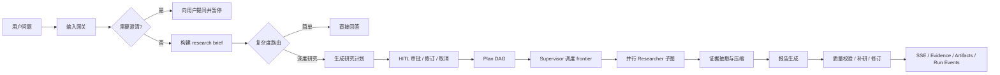
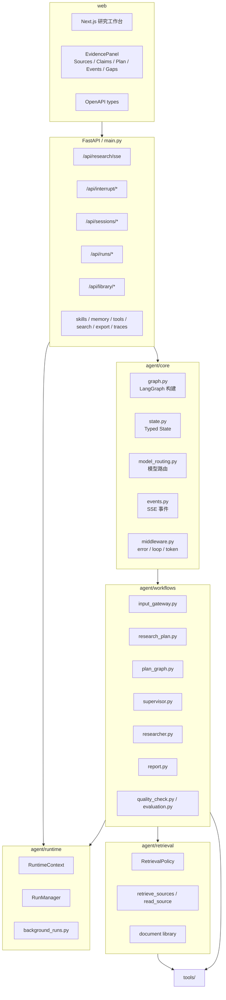
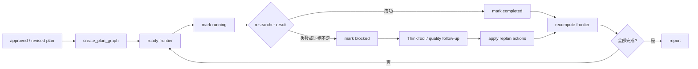
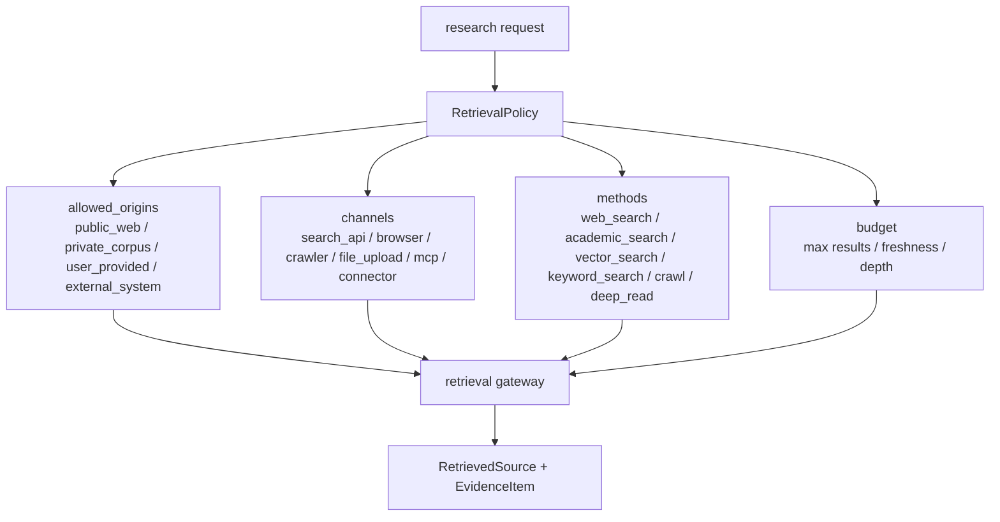
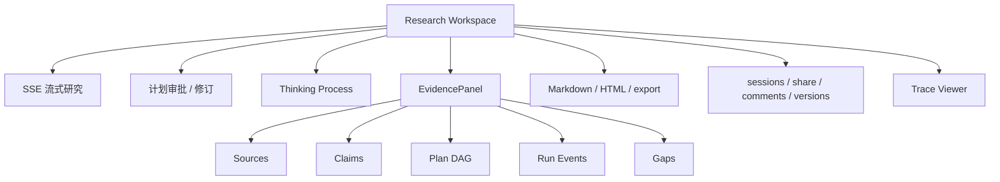

# Weaver

Weaver 是一个基于 LangGraph 的深度研究平台。它把复杂问题拆成可审批的研究计划、可追踪的 Plan DAG、并行 Researcher 子图、证据抽取、报告生成和质量校验，并通过 SSE 与前端工作台实时展示全过程。

[English summary](#english-summary)


## 项目定位

Weaver 面向长时程、证据驱动的研究任务。它不是一次性问答系统，而是一个可控的研究工作流：

- 先判断是否需要澄清，避免从错误问题出发。
- 再生成研究计划，并通过人工审批或修订后才进入高成本研究。
- 执行时以 Plan DAG 作为唯一计划状态，Supervisor 只调度当前 frontier 中可执行的任务。
- Researcher 在独立上下文里搜索、阅读、提取和压缩证据。
- 报告生成后再经过质量检查、引用覆盖、claim verifier 和可选自动修订。



## 核心能力

| 能力 | 当前实现 |
| --- | --- |
| 显式 DeepResearch 工作流 | `clarify -> brief -> classify -> plan -> supervisor -> researcher -> report -> evaluate` |
| HITL 计划门控 | 计划生成后通过 LangGraph interrupt 暂停，前端可批准、修订或取消 |
| Plan DAG | 批准后的计划转成 DAG；任务有依赖、frontier、状态、事件和 summary |
| Supervisor-workers | Supervisor 使用 `ConductResearch`、`ThinkTool`、`ResearchComplete` 调度多个 Researcher 子图 |
| 统一检索策略 | `RetrievalPolicy` 统一控制 public web、用户资料库、外部系统、搜索/爬取/深读等来源和方法 |
| 证据与质量 | evidence extraction、source registry、citation gate、claim verifier、rubric evaluation、auto-revision |
| Run events | 运行事件持久化到 `RunManager`，支持 REST 查询和 SSE 回放 |
| 记忆系统 | `agent/memory` 提供 Postgres/pgvector 与内存后端，按用户召回偏好、实体、证据线索和 procedural learning |
| Skills | public/custom skills 支持 allowlist、安装、编辑、历史和回滚 |
| 前端工作台 | Next.js 展示研究流、计划审批、Plan DAG、证据、运行事件、产物、会话协作和 traces |

## 架构总览



## 代码结构

```text
agent/core/
  graph.py              主 LangGraph 构建入口
  state.py              AgentState / SupervisorState / ResearcherState 与结构化工具 schema
  configuration.py      研究运行配置
  model_routing.py      fast / smart / strategic 三层模型与任务级覆盖
  llm_factory.py        多 provider ChatOpenAI 构造
  events.py             SSE 事件归一化与发送
  middleware.py         tool error / loop / token middleware

agent/workflows/
  input_gateway.py      澄清、research brief、复杂度分类
  research_plan.py      研究计划、interrupt/resume、Plan DAG 初始化
  plan_graph.py         DAG 创建、frontier 计算、replan action、todo 投影
  supervisor.py         supervisor loop 与并行 researcher 调度
  researcher.py         researcher ReAct loop 与检索策略注入
  report.py             最终报告、artifacts、质量补研与 Plan DAG replan
  interactive_continue.py  继续研究请求转为 Plan DAG replan
  quality_check.py      快速质量检查与自动修订
  evaluation.py         rubric / degradation evaluation
  evidence_extractor.py 证据与来源抽取
  source_registry.py    来源注册、评分与整理

agent/retrieval/
  policy.py             RetrievalPolicy：origin / channel / method / profile / budget
  gateway.py            统一检索网关：retrieve_sources / read_source
  documents.py          用户资料库、文档解析、chunk、hybrid ranking
  types.py              RetrievedSource / RetrievedPassage / RetrievalResult

agent/runtime/
  context.py            RuntimeContext
  runs.py               RunManager、run records、run-events 持久化与内存 fallback
  background_runs.py    后台研究运行
  middleware/shared.py  图运行共享 middleware

common/
  config.py             Settings 单一来源
  evidence_store.py     Evidence/session response patch
  session_manager.py    session、artifacts、Plan DAG、run events 读写
  research_events.py    SSE 事件到 canonical run event 的转换

web/
  Next.js 研究工作台，包含 SSE、计划审批、EvidencePanel、会话、版本、导出与 trace UI
```

## Plan DAG

Plan DAG 是当前研究计划的唯一主状态。`research_todos` 仍存在于部分 API response 中，但它只是从 DAG 派生的兼容投影，不再是独立计划版本。



Plan DAG 中的任务包含 `id`、`title`、`question`、`deps`、`status`、`priority`、`retrieval_policy_hint`、`evidence_ids`、`claim_ids`、`blocked_reason` 和 `result_preview` 等字段。状态变化会产生 `plan_graph_update` 事件，并写入 evidence/session artifacts。

## RetrievalPolicy

检索层只保留 `RetrievalPolicy` 这一套策略语义。旧 `source_routing` 输入会在 API/runtime 边界被拒绝，避免在代码中同时维护两套路由方案。



Supervisor 和 Researcher 接收同一份 `retrieval_policy`。Plan DAG 任务如需来源偏好，只写 `retrieval_policy_hint`，不会恢复旧的 `source_routing`。

## Run Events

运行过程中的关键事件会被标准化并持久化，前端可以查询历史或用 SSE 回放：

| 接口 | 作用 |
| --- | --- |
| `GET /api/runs` | 运行列表 |
| `GET /api/runs/{thread_id}` | 单个 run 的指标与状态 |
| `GET /api/runs/{thread_id}/events?after_seq=0` | 查询指定序号后的持久化事件 |
| `GET /api/runs/{thread_id}/events/sse?after_seq=0` | 用 SSE 回放持久化事件 |
| `POST /api/runs/background` | 提交后台研究 |
| `GET /api/runs/{thread_id}/background` | 查询后台运行状态 |

Postgres 可用时会自动创建 `weaver_run_events` 表；开发或测试环境会回退到内存实现。

## API 一览

| 分组 | 路由 |
| --- | --- |
| Research | `POST /api/research/sse`, `POST /api/research/cancel/{thread_id}`, `POST /api/research/cancel-all`, `POST /api/research/fork` |
| Interrupt | `GET /api/interrupt/{thread_id}/status`, `POST /api/interrupt/{thread_id}/resume`, `POST /api/interrupt/resume` |
| Sessions | `GET /api/sessions`, `GET /api/sessions/{thread_id}`, `DELETE /api/sessions/{thread_id}`, `GET /api/sessions/{thread_id}/state`, `GET /api/sessions/{thread_id}/evidence`, `POST /api/sessions/{thread_id}/resume`, `POST /api/sessions/{thread_id}/continue-research` |
| Runs | run list、background run、run metrics、run events、event SSE replay、resume marker、user sources injection |
| Library/Retrieval | document library status/upload/list/delete/reindex/search, `POST /api/retrieval/search` |
| Collaboration | share links、comments、versions、restore |
| Skills | public/custom skills 的 list、read、update、install、history、rollback |
| Memory | memory list、record create/delete、retrieve、graph、status、skill evolution |
| Tools/Search | active tasks、tool registry、search providers、cache stats/reset/clear |
| Export/Traces | export templates、thread export、trace detail、trace summary |
| Health/Ops | `/`, `/health`, `/api/health/agent`, `/api/config/public`, `/metrics` |

## 前端工作台



前端位于 `web/`，使用 Next.js。它消费后端 OpenAPI 生成的 TypeScript 类型，并通过 `fetchResearchEvidence()`、`fetchRunEvents()` 等客户端函数读取证据、Plan DAG 和运行事件。

## 配置

配置集中在 `common/config.py`，通过环境变量覆盖。常用分组如下：

```bash
# LLM providers
OPENAI_API_KEY=...
OPENAI_BASE_URL=...
AZURE_OPENAI_API_KEY=...
DASHSCOPE_API_KEY=...

# Model routing
PRIMARY_MODEL=qwen-plus
REASONING_MODEL=qwen-plus
FAST_LLM_MODEL=qwen-turbo
SMART_LLM_MODEL=qwen-plus
STRATEGIC_LLM_MODEL=qwen-plus
PLANNER_MODEL=...
RESEARCHER_MODEL=...
WRITER_MODEL=...
EVALUATOR_MODEL=...

# Search and retrieval providers
TAVILY_API_KEY=...
BOCHA_API_KEY=...
SERPER_API_KEY=...
SERPAPI_API_KEY=...
BING_API_KEY=...
BRAVE_API_KEY=...
EXA_API_KEY=...
FIRECRAWL_API_KEY=...
GOOGLE_SEARCH_API_KEY=...
GOOGLE_SEARCH_ENGINE_ID=...

# Runtime behavior
MEMORY_ENABLED=true
MEMORY_BACKEND=postgres
MEMORY_DATABASE_URL=
MEMORY_EMBEDDING_MODEL=text-embedding-3-small
ENABLE_MCP=false
HUMAN_REVIEW=true
TOOL_APPROVAL=false
DEEPSEARCH_MODE=auto

# API and operations
WEAVER_INTERNAL_API_KEY=...
DATABASE_URL=sqlite:///./data/weaver.db
ENABLE_PROMETHEUS=false
```

## 开发与测试

本地开发使用名为 `weaver` 的 conda 环境：

```bash
# 后端
/home/song/anaconda3/bin/conda run -n weaver python main.py

# 后端测试
PYTHONPATH=. /home/song/anaconda3/bin/conda run -n weaver python -m pytest tests/ -v

# 前端检查
npx --yes -p node@24 bash -lc 'cd web && node_modules/.bin/next lint'
npx --yes -p node@24 bash -lc 'cd web && node_modules/.bin/tsc --noEmit'

# OpenAPI TypeScript 类型同步
DEBUG=false APP_ENV=prod ENABLE_FILE_LOGGING=false \
  /home/song/anaconda3/bin/conda run -n weaver python scripts/export_openapi.py --output /tmp/weaver-openapi.json
npx --yes -p node@24 -p openapi-typescript openapi-typescript /tmp/weaver-openapi.json -o web/lib/api-types.ts
npx --yes -p node@24 -p openapi-typescript openapi-typescript /tmp/weaver-openapi.json -o sdk/typescript/src/openapi-types.ts
```

常规启动仍可使用：

```bash
./start_weaver.sh
```

## English Summary

Weaver is a LangGraph-based deep research platform. It turns complex user questions into a controlled pipeline: clarification, research brief, complexity routing, human-approved planning, Plan DAG orchestration, parallel researcher subgraphs, evidence extraction, report generation, quality checks, and persisted run events.

The current design keeps one canonical planning path: Plan DAG. Compatibility fields such as `research_todos` are derived from the graph. Retrieval is controlled by one `RetrievalPolicy`; deprecated `source_routing` payloads are rejected at API/runtime boundaries. Run events are persisted through `RunManager` and exposed through REST and SSE replay endpoints.

## License

MIT License. See [LICENSE](LICENSE).
