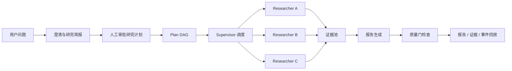
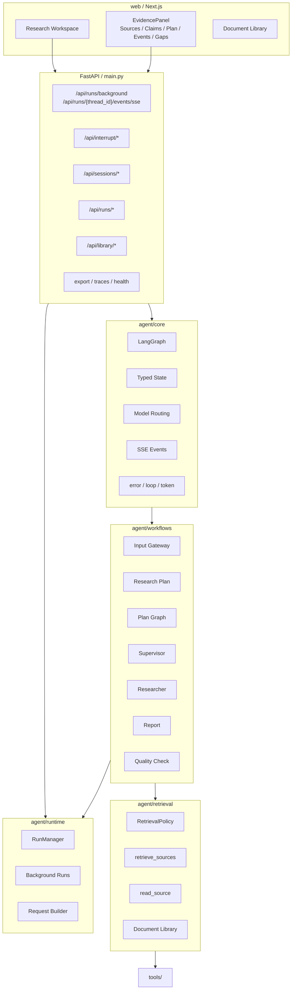
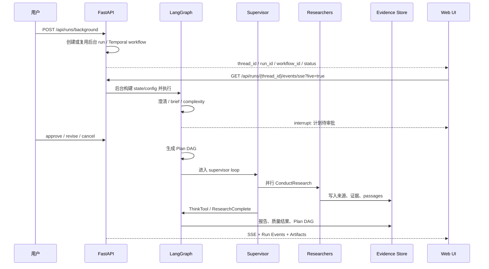
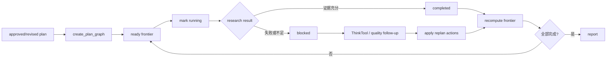
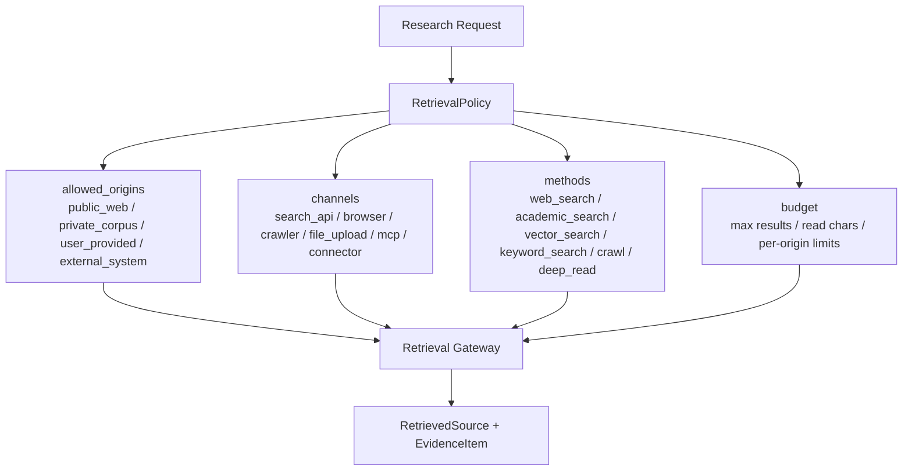
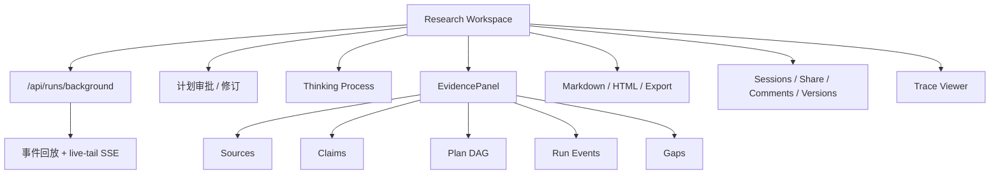

# SoulSearcher

默认文档：中文 | [English](README.en.md)

SoulSearcher 是一个基于 LangGraph 的深度研究 Agent 平台。它把开放式问题转成可审批、可追踪、可复盘的研究流程：澄清问题、生成研究简报、人工审批计划、执行 Plan DAG、并行调度研究员、沉淀证据、生成报告、质量校验，并把全过程通过 SSE、Evidence Panel 和 Run Events 展示出来。


## 一句话介绍

SoulSearcher 不是普通聊天机器人，也不是单纯 RAG。它是面向复杂研究任务的 **Workflow + Agent** 系统：确定性环节由代码控制，开放性探索交给模型和工具，所有关键状态都被结构化记录。



## 核心能力

| 能力 | 当前实现 |
| --- | --- |
| 显式研究工作流 | `clarify -> brief -> classify -> plan -> supervisor -> researcher -> report -> evaluate` |
| 人工计划门控 | 研究计划生成后通过 LangGraph interrupt 暂停，用户可批准、修订或取消 |
| Plan DAG | 计划任务有依赖、frontier、状态、证据链接、结果预览和 replan events |
| 并行研究员 | Supervisor 用结构化工具调度多个 Researcher 子图，子图独立上下文执行 |
| 统一检索策略 | `RetrievalPolicy` 控制公开网页、私有资料库、用户提供来源、连接器、检索方法和预算 |
| 证据系统 | evidence items、passages、source registry、citation annotations、claim support |
| 质量控制 | citation gate、claim verifier、rubric evaluation、自动修订和质量补研 |
| Run Events | 运行事件持久化，支持 REST 查询与 replay + live-tail SSE，浏览器断线后可断点续看 |
| A2A 1.0 Server | 发布 `/.well-known/agent-card.json`，通过 `/api/a2a` 提供 JSON-RPC DeepResearch；Temporal 模式下 `SendMessage/SendStreamingMessage` 会启动后台 workflow 并立即返回 working |
| 长期记忆 | 可选 memory service，支持实体、关系、研究发现和 procedural learning |
| Skills | public/custom skills，支持 allowlist、安装、编辑、历史和回滚 |
| 前端工作台 | Next.js 展示研究流、计划审批、证据、Plan DAG、Events、产物、会话和 traces |

## 整体架构



## 真实代码结构

```text
agent/core/
  graph.py              主 LangGraph 构建入口
  state.py              AgentState / SupervisorState / ResearcherState 与结构化工具 schema
  configuration.py      研究运行配置
  model_routing.py      fast / smart / strategic 三层模型与任务级覆盖
  events.py             SSE 事件归一化与发送
  middleware.py         tool error / loop / token middleware

agent/workflows/
  input_gateway.py      澄清、research brief、复杂度分类
  research_plan.py      研究计划、interrupt/resume、Plan DAG 初始化
  plan_graph.py         DAG 创建、frontier 计算、任务状态、replan actions
  supervisor.py         supervisor loop 与并行 researcher 调度
  researcher.py         researcher ReAct loop 与检索策略注入
  report.py             最终报告、artifacts、质量补研与 Plan DAG replan
  interactive_continue.py  继续研究请求转成 replan actions
  quality_check.py      快速质量检查与自动修订
  evaluation.py         rubric / degradation evaluation

agent/retrieval/
  policy.py             RetrievalPolicy：origin / channel / method / profile / budget
  gateway.py            统一检索网关：retrieve_sources / read_source
  documents.py          用户资料库解析、chunk、hybrid ranking

agent/runtime/
  runs.py               Run records、run-events 持久化、内存 fallback
  background_runs.py    后台研究任务
  request_builder.py    request -> graph state/config

common/
  config.py             Settings 单一来源
  evidence_store.py     Evidence/session response patch
  session_manager.py    session、artifacts、Plan DAG、run-events 读写

web/
  Next.js 研究工作台、EvidencePanel、文档库、stream protocol、OpenAPI TS types
```

## 研究执行流程



## Plan DAG：唯一计划状态

Plan DAG 是当前版本唯一的计划状态。`research_todos` 只作为兼容投影存在，由 DAG 派生，不再是第二套计划系统。



任务字段包括 `id`、`title`、`question`、`deps`、`status`、`priority`、`retrieval_policy_hint`、`evidence_ids`、`claim_ids`、`blocked_reason`、`result_preview` 等。状态更新会触发 `plan_graph_update`，并写入 session/evidence artifacts。

## RetrievalPolicy：唯一检索策略

SoulSearcher 只保留一套检索策略：`RetrievalPolicy`。旧式来源路由输入会在 API/runtime 边界被拒绝，避免多套路由方案并存。



## Run Events：可回放的运行过程

| 接口 | 作用 |
| --- | --- |
| `GET /api/runs` | 运行列表 |
| `GET /api/runs/{thread_id}` | 单个 run 的指标与状态 |
| `GET /api/runs/{thread_id}/events?after_seq=0` | 查询指定序号后的持久化事件 |
| `GET /api/runs/{thread_id}/events/sse?after_seq=0&live=true` | 回放持久化事件并 live-tail，支持 `Last-Event-ID`、heartbeat 和断线重连 |
| `POST /api/runs/background` | 提交或幂等复用后台研究，Temporal 模式返回 `workflow_id/execution_backend/status` |
| `GET /api/runs/{thread_id}/background` | 查询后台运行状态 |
| `POST /api/runs/{thread_id}/background/cancel` | 取消后台研究；Temporal 模式通过 workflow cancel/signal 落库 |

Postgres 后端会自动创建 `soulsearcher_run_events` 表；开发和测试环境可回退到内存实现。

## API 一览

| 分组 | 路由 |
| --- | --- |
| Research | `POST /api/runs/background` + events SSE 为深度研究默认入口；`POST /api/research/sse` 仅保留短会话/兼容路径 |
| Interrupt | interrupt status 与 canonical resume |
| Sessions | session list/detail/state/evidence/resume/continue/delete |
| Runs | run list、metrics、background、events、event replay、source injection |
| Library/Retrieval | document library、document search、retrieval search |
| Collaboration | share links、comments、versions、restore |
| Skills | public/custom skills 的 list、read、update、install、history、rollback |
| Memory | records、retrieve、graph、status、skill evolution |
| Tools/Search | active tasks、tool registry、providers、cache stats/reset/clear |
| Export/Traces | report export、templates、trace detail、trace summary |
| Health/Ops | `/`, `/health`, `/api/health/agent`, `/api/config/public`, `/metrics` |

## 前端工作台



## 配置

配置集中在 `common/config.py`，通过环境变量覆盖：

```bash
# LLM providers
OPENAI_API_KEY=...
OPENAI_BASE_URL=...
AZURE_OPENAI_API_KEY=...
DASHSCOPE_API_KEY=...

# Model routing
PRIMARY_MODEL=qwen-plus
REASONING_MODEL=qwen-plus
FAST_LLM_MODEL=qwen-turbo
SMART_LLM_MODEL=qwen-plus
STRATEGIC_LLM_MODEL=qwen-plus
PLANNER_MODEL=...
RESEARCHER_MODEL=...
WRITER_MODEL=...
EVALUATOR_MODEL=...

# Search providers
TAVILY_API_KEY=...
BOCHA_API_KEY=...
SERPER_API_KEY=...
SERPAPI_API_KEY=...
BING_API_KEY=...
BRAVE_API_KEY=...
EXA_API_KEY=...
FIRECRAWL_API_KEY=...

# Runtime
MEMORY_ENABLED=true
MEMORY_BACKEND=postgres
MEMORY_DATABASE_URL=
ENABLE_MCP=false
HUMAN_REVIEW=true
TOOL_APPROVAL=false
DEEPSEARCH_MODE=auto
BACKGROUND_RUNS_ENABLED=true
SOULSEARCHER_BACKGROUND_EXECUTION_BACKEND=temporal
TEMPORAL_ADDRESS=127.0.0.1:7233
TEMPORAL_NAMESPACE=default
TEMPORAL_TASK_QUEUE=soulsearcher-deep-research

# API / Ops
SOULSEARCHER_INTERNAL_API_KEY=...
DATABASE_URL=sqlite:///./data/soulsearcher.db
ENABLE_PROMETHEUS=false
```

## A2A 1.0 Server

SoulSearcher 作为 A2A 1.0 JSON-RPC Server 暴露 DeepResearch：

```text
GET  /.well-known/agent-card.json
POST /api/a2a
```

Agent Card 的 `supportedInterfaces[0]` 使用 `protocolBinding="JSONRPC"`、`protocolVersion="1.0"`、`url=<SOULSEARCHER_PUBLIC_BASE_URL>/api/a2a`。`/api/a2a` 走现有 `/api/*` 鉴权；如果设置了 `SOULSEARCHER_INTERNAL_API_KEY`，A2A Client 需要携带 `Authorization: Bearer <key>` 或 `X-API-Key: <key>`。

本地给 SoulClaw 使用的最小配置：

```env
PORT=8001
SOULSEARCHER_PUBLIC_BASE_URL=http://127.0.0.1:8001
SOULSEARCHER_INTERNAL_API_KEY=
SOULSEARCHER_AUTH_USER_HEADER=X-SoulSearcher-User
SOULSEARCHER_A2A_STALLED_TIMEOUT_SECONDS=900
SOULSEARCHER_A2A_IDEMPOTENCY_TTL_SECONDS=86400
SOULSEARCHER_A2A_CALLBACK_RETRY_ATTEMPTS=2
SOULSEARCHER_A2A_CALLBACK_TOKEN=
SOULSEARCHER_A2A_CALLBACK_OUTBOX_ENABLED=true
SOULSEARCHER_BACKGROUND_EXECUTION_BACKEND=temporal
TEMPORAL_ADDRESS=127.0.0.1:7233
TEMPORAL_NAMESPACE=default
TEMPORAL_TASK_QUEUE=soulsearcher-deep-research
```

在 SoulClaw 集成场景里，SoulSearcher 是 DeepResearch Worker，不直接面向用户做最终解释：

- A2A task snapshot 通过现有 `run_manager`/checkpoint 数据持久化；服务重启后仍可 `GetTask`、`CancelTask` 和查询事件。
- Temporal 是生产长任务执行层：workflow 只编排状态、signal 和 cancel；LLM、浏览器、检索和事件落库在 activity 中执行，保证 workflow deterministic。`local` backend 只用于测试和轻量开发。
- 浏览器端深度研究默认先调用 `/api/runs/background`，再订阅 `/api/runs/{thread_id}/events/sse?live=true`；`/api/research/sse` 仅作为短会话/兼容路径保留。
- 同一 `taskId/contextId` 的后续输入如果命中 `input-required/auth-required`，会调用 LangGraph `Command(resume=...)` 继续原研究，不重新启动。
- LangGraph interrupt 会转换为结构化 HITL metadata：`kind`、`thread_id`、`task_id`、`prompts`、`allowed_decisions`、`action_requests`、`review_configs`。
- 失败会返回标准 error envelope：`code`、`message`、`stage`、`failure_class`、`retryable`、`ambiguous`、`requires_reconcile`、`trace_id`、`last_event_seq`、`partial_artifacts`、`suggested_action`。
- `metadata.client_request_id` 或 `metadata.idempotency_key` 用于长程任务幂等；同 key 同 payload 的重复启动请求返回原 task，同 key 不同 payload 会拒绝。
- 长时间无事件的工作中任务会标记 `stalled`，并通过 task event 或 callback 暴露给 SoulClaw。
- 如果请求 metadata 提供 `callback_url/callback_token`，SoulSearcher 会对 `task.status_update`、`task.artifact_update`、`task.completed`、`task.failed`、`task.input_required`、`task.stalled` 先写 callback outbox 再投递；配置数据库时回调可持久重试并进入 dead-letter。

## 开发与验证

```bash
# 启动完整本地应用
./start_soulsearcher.sh

# 后端
python main.py

# 后端热重载
DEBUG=true SOULSEARCHER_RELOAD=1 python main.py

# Temporal 长任务 worker
SOULSEARCHER_BACKGROUND_EXECUTION_BACKEND=temporal python -m agent.runtime.temporal_worker

# Docker 完整长任务栈
SOULSEARCHER_BACKGROUND_EXECUTION_BACKEND=temporal docker compose -f docker/docker-compose.yml --profile temporal up -d --build
```

```bash
# Python 测试
PYTHONPATH=. python -m pytest tests/ -v

# 前端检查
npx --yes -p node@24 bash -lc 'cd web && node_modules/.bin/next lint'
npx --yes -p node@24 bash -lc 'cd web && node_modules/.bin/tsc --noEmit'

# OpenAPI 类型同步
DEBUG=false APP_ENV=prod ENABLE_FILE_LOGGING=false \
  python scripts/export_openapi.py --output /tmp/soulsearcher-openapi.json
npx --yes -p node@24 -p openapi-typescript openapi-typescript /tmp/soulsearcher-openapi.json -o web/lib/api-types.ts
npx --yes -p node@24 -p openapi-typescript openapi-typescript /tmp/soulsearcher-openapi.json -o sdk/typescript/src/openapi-types.ts
```

## SDK

仓库内置私有 SDK，位于 `sdk/`：

- TypeScript：`SoulSearcherClient`
- Python：`soulsearcher_sdk.SoulSearcherClient`

详见 [sdk/README.md](sdk/README.md)。

## License

MIT License. See [LICENSE](LICENSE).
