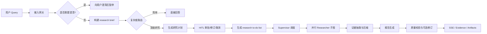
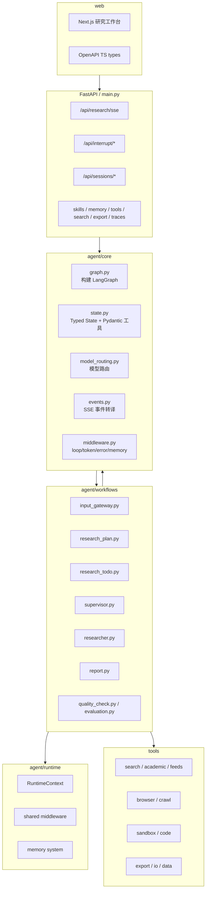
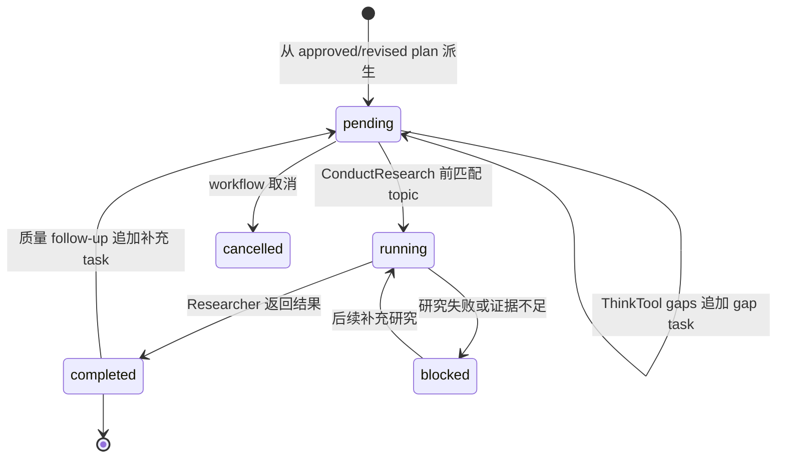
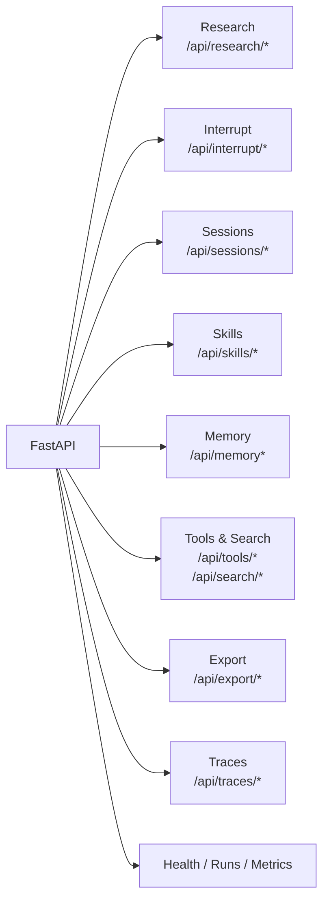
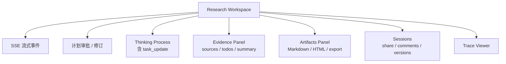
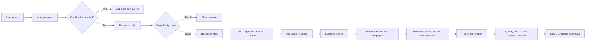

# Weaver

一个基于 LangGraph 的深度研究平台：用显式工作流把复杂问题拆解为澄清、研究计划、监督调度、并行研究、证据压缩、报告生成和质量校验，并通过 SSE 与前端工作台实时展示全过程。

[English version](#english-version)


## 项目定位

Weaver 面向长时程、证据驱动的研究任务。它不是简单的一次性问答，而是让系统先理解用户问题，再生成可审批的研究计划，并在执行过程中持续维护内部 research to-do list，避免长任务偏离目标。



## 核心能力

| 能力 | 当前实现 |
| --- | --- |
| 显式 DeepResearch 工作流 | `clarify -> brief -> classify -> plan -> supervisor -> researcher -> report -> evaluate` |
| HITL 研究计划 | 计划生成后通过 LangGraph interrupt 暂停，前端可批准、修订或取消 |
| 内生 research to-do | 从批准后的 plan 派生任务，执行中随 supervisor / ThinkTool / 质量跟进更新 |
| Supervisor-workers | Supervisor 用结构化工具调度多个 Researcher 子图，并保留压缩后的研究结果 |
| 三层模型路由 | fast / smart / strategic 三档模型，加 planner、researcher、writer、evaluator 等任务级覆盖 |
| 证据与质量 | evidence extraction、source registry、citation gate、claim verifier、rubric evaluation、auto-revision |
| 工具生态 | Web/academic/feed 搜索、browser/crawl、sandbox/code、MCP、image、export、automation |
| 记忆系统 | 报告后记录用户级研究记忆，后续请求可按相关性注入上下文 |
| Skills | 20 个 public skills + custom skills，支持 allowlist、安装、编辑、历史与回滚 |
| 前端工作台 | SSE 流式研究、计划审批、思考过程、证据、任务、产物、会话、评论、版本、导出与 traces |

## 架构总览



## 真实代码结构

```text
agent/core/
  graph.py              主 LangGraph 构建入口
  state.py              AgentState / SupervisorState / ResearcherState 与结构化工具 schema
  configuration.py      研究运行配置
  model_routing.py      三层模型与任务级模型路由
  llm_factory.py        多 provider ChatOpenAI 构造
  events.py             SSE 事件归一化与发送
  middleware.py         tool error / loop / token / memory middleware
  search_cache.py       搜索结果缓存

agent/workflows/
  input_gateway.py      澄清、research brief、复杂度分类
  research_plan.py      研究计划与 interrupt/resume
  research_todo.py      workflow 内生 research to-do 状态
  supervisor.py         supervisor loop 与并行 researcher 调度
  researcher.py         researcher ReAct loop 与混合压缩
  report.py             最终报告、artifacts、HTML/Markdown、图片注入
  quality_check.py      快速质量检查与自动修订
  evaluation.py         更深层 rubric / degradation evaluation
  source_routing.py     web / academic / MCP source policy
  evidence_extractor.py 证据与来源抽取
  source_registry.py    来源注册、评分与整理

agent/runtime/
  context.py            RuntimeContext
  middleware/shared.py  图运行共享 middleware
  memory/               用户级 memory 存储、队列、更新器与 prompt

tools/
  search/               web、academic、feeds、provider reliability、cache
  browser/, crawl/      浏览器与网页抽取
  sandbox/, code/       受控命令与代码执行
  planning/             planning 工具
  automation/           独立自动化工具
  export/, io/, data/   导出、输入输出和数据工具

web/
  Next.js 14 前端工作台，包含 SSE、计划审批、证据、任务、产物、会话、版本、导出与 trace UI
```

当前运行时以显式 DeepResearch workflow 为主。上面的模块图和 API 列表描述的是当前版本仍在使用的代码路径。

## DeepResearch 工作流

### 1. 请求进入

用户通过 `/api/research/sse` 发起研究请求。后端在进入图之前处理鉴权、限流、取消注册、SSE keepalive、会话追踪和事件转译。

### 2. 输入网关

输入网关判断问题是否需要澄清、是否可以直接回答，或是否应进入深度研究。进入深度研究时，会构建标准化 `research_brief` 并进行复杂度分类。

### 3. 计划审批

`research_plan.py` 生成 Markdown 研究计划，并通过 LangGraph interrupt 暂停。用户可以在前端批准、修订或取消计划。修订后的计划会重新进入后续执行。

### 4. Research To-Do List

计划被批准后，`research_todo.py` 会从 plan 中派生最多 8 个内部任务，优先解析 `Sub-topics`。它不是用户可编辑的项目管理器，而是 DeepResearch 内部控制状态。



任务变化会以 `task_update` SSE 事件推送给前端，并写入 `/api/sessions/{thread_id}/evidence` 返回的 `research_todos` 与 `todo_summary`。

### 5. Supervisor 调度

Supervisor 每轮会看到 research brief、研究计划、已有研究摘要和 compact todo 状态，然后通过结构化工具决策：

| 工具 | 作用 |
| --- | --- |
| `ConductResearch` | 生成一个或多个具体研究 topic，启动并行 researcher 子图 |
| `ThinkTool` | 反思当前证据、缺口、置信度和下一步策略 |
| `ResearchComplete` | 在证据足够时结束研究阶段 |

To-do list 是软约束：Supervisor 会被提示优先覆盖未完成任务，但仍可根据证据主动新增研究方向。

### 6. Researcher 子图

每个 researcher 在独立上下文中运行，执行搜索、浏览、网页抽取、工具调用、图像读取等操作。返回 supervisor 前，会通过混合压缩策略缩减结果，保留高价值摘要和来源线索。

### 7. 报告与质量

`report.py` 汇总证据并生成最终报告和 artifacts。随后质量模块可执行快速检查、自动修订、引用覆盖检查、claim verifier 和 rubric evaluation。

### 8. 返回与持久化

执行期间前端持续接收 SSE 事件；结束后会保存 session、evidence、sources、artifacts、research todos、trace、comments 和 versions，供后续查看、继续研究或导出。

## API 一览



| 分组 | 路由 |
| --- | --- |
| Research | `POST /api/research/sse`, `POST /api/research/cancel/{thread_id}`, `POST /api/research/cancel-all`, `POST /api/research/fork` |
| Interrupt | `GET /api/interrupt/{thread_id}/status`, `POST /api/interrupt/{thread_id}/resume`, `POST /api/interrupt/resume` |
| Sessions | `GET /api/sessions`, `GET /api/sessions/{thread_id}`, `DELETE /api/sessions/{thread_id}`, `GET /api/sessions/{thread_id}/state`, `GET /api/sessions/{thread_id}/evidence`, `POST /api/sessions/{thread_id}/resume`, `POST /api/sessions/{thread_id}/continue-research` |
| Collaboration | `POST /api/sessions/{thread_id}/share`, `GET /api/share/{share_id}`, `DELETE /api/share/{share_id}`, comments、versions、restore 相关路由 |
| Skills | public/custom skills 的 list、read、update、install、history、rollback |
| Memory | `GET /api/memory`, `POST /api/memory/reload`, `GET /api/memory/status` |
| Tools/Search | `GET /api/tasks/active`, `GET /api/tools/registry`, search providers/cache stats/reset/clear |
| Export/Traces | `GET /api/export/templates`, `GET /api/export/{thread_id}`, `GET /api/traces/{thread_id}`, `GET /api/traces/{thread_id}/all`, `GET /api/traces/{thread_id}/summary` |
| Health/Runs | `GET /`, `GET /health`, `GET /api/health/agent`, `GET /api/config/public`, `GET /api/runs`, `GET /api/runs/{thread_id}`, `GET /metrics` |

## 前端工作台



前端位于 `web/`，使用 Next.js 14。它会消费后端 OpenAPI 生成的 TypeScript 类型，并展示研究执行、计划审批、证据、任务进度、报告产物、会话协作和 trace 信息。

## 配置

配置集中在 `common/config.py`，通过环境变量覆盖。常用分组如下：

```bash
# LLM providers
OPENAI_API_KEY=...
OPENAI_BASE_URL=...
AZURE_OPENAI_API_KEY=...
DASHSCOPE_API_KEY=...

# Model routing
PRIMARY_MODEL=qwen-plus
REASONING_MODEL=qwen-plus
FAST_LLM_MODEL=qwen-turbo
SMART_LLM_MODEL=qwen-plus
STRATEGIC_LLM_MODEL=qwen-plus
PLANNER_MODEL=...
RESEARCHER_MODEL=...
WRITER_MODEL=...
EVALUATOR_MODEL=...

# Search providers
TAVILY_API_KEY=...
BOCHA_API_KEY=...
SERPER_API_KEY=...
SERPAPI_API_KEY=...
BING_API_KEY=...
BRAVE_API_KEY=...
EXA_API_KEY=...
FIRECRAWL_API_KEY=...
GOOGLE_SEARCH_API_KEY=...
GOOGLE_SEARCH_ENGINE_ID=...

# Runtime behavior
ENABLE_MEMORY=true
ENABLE_MCP=false
HUMAN_REVIEW=true
TOOL_APPROVAL=false
DEEPSEARCH_MODE=auto

# API and operations
WEAVER_INTERNAL_API_KEY=...
DATABASE_URL=sqlite:///./data/weaver.db
ENABLE_PROMETHEUS=false
```

DeepSearch 相关配置还覆盖 supervisor 轮次、并行 researcher 数量、上下文压缩、搜索新鲜度、claim verifier、citation gate、summary trigger 和 guardrails。

## Skills

当前仓库包含 20 个 public skills，位于 `skills/public/`；自定义 skills 位于 `skills/custom/`。Skill 使用 `SKILL.md` 描述能力和工具 allowlist，运行时支持安装、读取、编辑、历史和回滚。

## 开发与测试

### 后端

```bash
make setup
python main.py

# 热重载
DEBUG=true WEAVER_RELOAD=1 python main.py
```

### 前端

```bash
cd web
npm install
npm run dev
```

### 检查

```bash
# Python 测试
conda run -n weaver python -m pytest tests/ -q

# 前端类型检查
cd web
npx tsc --noEmit --pretty false

# OpenAPI 类型生成
npm run api:types

# 仓库级检查
make test
make lint
make verify
```

`make verify` 会执行编译检查、pytest、OpenAPI 类型生成、live API smoke check 和前端 e2e hook。

## 数据与运行时文件

本地默认运行时文件位于 `data/`，包括 session 状态、memory 文件、traces、协作元数据和生成的 artifacts。密钥、凭证和真实 API key 应放在环境变量或被忽略的本地配置文件中。

## English Version

<details>
<summary>Click to expand the English README</summary>

Weaver is a LangGraph-based deep research platform. It turns complex questions into a controlled workflow with clarification, research planning, supervisor orchestration, parallel researcher subgraphs, evidence compression, report generation, quality checks, and real-time SSE updates.

### Workflow



### Highlights

| Area | Implementation |
| --- | --- |
| Typed workflow | `AgentState`, `SupervisorState`, `ResearcherState`, and Pydantic tool schemas |
| HITL plan gate | LangGraph interrupt lets users approve, revise, or cancel before execution |
| Research to-dos | Internal tasks derived from the approved plan and updated during supervisor execution |
| Supervisor-workers | The supervisor calls `ConductResearch`, `ThinkTool`, and `ResearchComplete` |
| Model routing | Fast, smart, and strategic model tiers, plus task-level overrides |
| Evidence and quality | Evidence extraction, source registry, citation gate, claim verifier, rubric evaluation, auto-revision |
| Tooling | Web/academic/feed search, browser/crawl, sandbox/code, MCP, image, export, automation |
| Frontend | Next.js workspace for streaming research, plan approval, evidence, artifacts, sessions, versions, traces |

### Main API Groups

- Research: `/api/research/sse`, cancel, cancel-all, fork
- Interrupts: `/api/interrupt/{thread_id}/status`, resume endpoints
- Sessions: session state, evidence, resume, continue-research, share, comments, versions, restore
- Skills: public/custom skill list, read, update, install, history, rollback
- Memory: memory read, reload, status
- Tools and search: task activity, tool registry, search providers, cache stats/reset/clear
- Export and traces: export templates, export by thread, trace summary and detail
- Health and runs: `/`, `/health`, `/api/health/agent`, `/api/config/public`, `/api/runs`, `/metrics`

### Development

```bash
make setup
python main.py

cd web
npm install
npm run dev
```

```bash
conda run -n weaver python -m pytest tests/ -q
cd web
npx tsc --noEmit --pretty false
npm run api:types
make verify
```

</details>

## License

MIT License. See [LICENSE](LICENSE).
