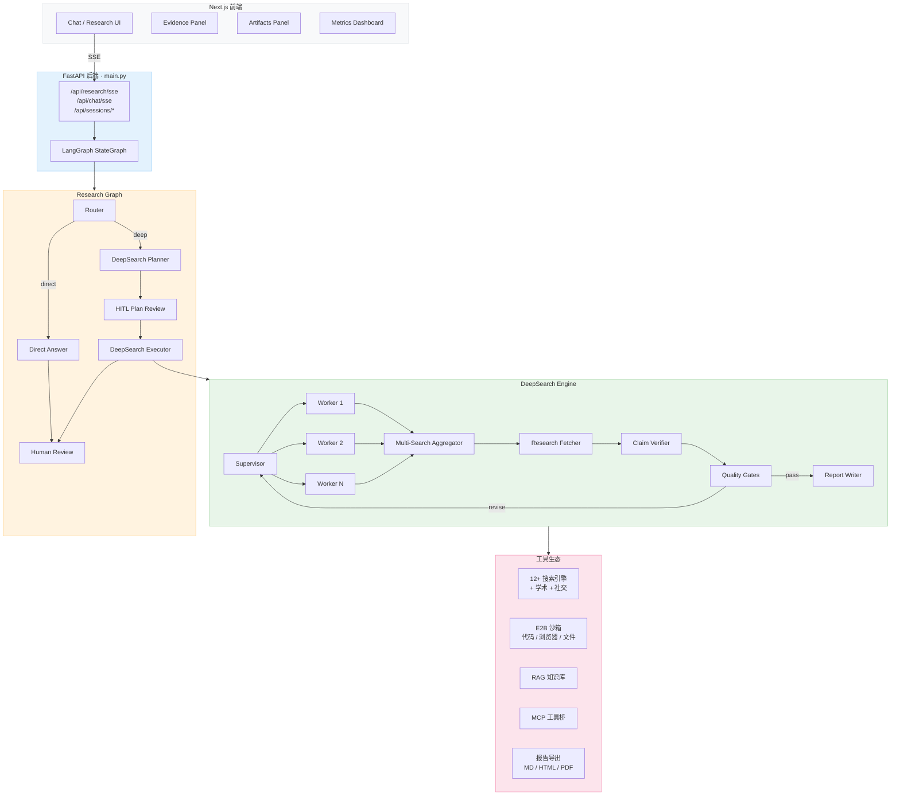

<div align="right">
  <strong>简体中文</strong> |
  <a href="docs/README.en.md">English</a>
</div>

<div align="center">

# Weaver — AI Deep Research 平台

**基于 LangGraph 的全栈 AI 深度研究平台 · Supervisor-Workers 多轮研究 · 多源聚合搜索 · 证据溯源 · HITL 人机协同**


[详细文档](docs/README.md) · [English Docs](docs/README.en.md) · [问题反馈](https://github.com/LittleSongxx/Weaver_pro/issues)


</div>

---

## 项目定位

Weaver 是一个面向**深度研究**场景的全栈 AI Agent 平台。核心能力是自动化完成复杂信息调研：从用户提问出发，通过多轮并行搜索、证据抓取、声明验证，生成带引用的结构化研究报告。同时集成沙箱代码执行、浏览器自动化、RAG 知识库、MCP 工具桥等能力，适合用作 AI 驱动的研究助理。

---

## 核心特性

- **Plan-and-Execute 深度研究**：Supervisor 分配子任务 → 多 Worker 并行检索 → 多轮迭代直到质量门禁通过
- **多源聚合搜索**：12+ 搜索引擎（Tavily / Bocha / DuckDuckGo / Serper / Bing / Exa / Google CSE / Firecrawl）+ 学术源（arXiv / PubMed / Semantic Scholar）+ 社交源（Twitter / Reddit / HackerNews），支持 fallback / parallel / round_robin 策略
- **证据溯源与验证**：Claim Verifier 逐条验证声明、Evidence Passages 段落级定位、Citation Gate 引用覆盖率门禁、Fact Cards 结构化证据卡
- **HITL 人机协同**：研究计划审核（hitl_plan_review）+ 最终报告审核（human_review），支持用户在流程中编辑/批准/拒绝
- **多模型支持**：OpenAI / DeepSeek / Anthropic / Azure / Ollama，不同研究阶段可路由到不同模型
- **10 个 Skill 技能**：deep-researcher / data-analyst / competitive-analyst / code-assistant / writing-assistant / translator / finance-calculator / ppt-maker / web-scraper / mindmap-generator
- **E2B 沙箱工具链**：Python 代码执行、浏览器自动化、文件操作、Shell 命令、Excel/PPT 生成、图像处理
- **RAG 知识库**：文档上传 → ChromaDB 向量化 → 研究时自动召回
- **MCP 工具桥**：通过 Model Context Protocol 桥接 filesystem / memory / git / postgres 等第三方工具
- **会话管理**：PostgreSQL 持久化、会话恢复 / 续研 / 分享 / 评论 / 版本快照
- **SSE 实时流**：前端实时渲染研究进度、搜索结果、工具调用、质量指标
- **报告导出**：Markdown / HTML / PDF，支持自定义模板

---

## 架构概览



---

## 项目结构

```
Weaver/
├── main.py                         # FastAPI 入口（5000+ 行，所有 API 端点）
├── agent/                          # LangGraph Agent 核心
│   ├── core/                       # 图定义、状态、事件、上下文管理
│   │   ├── graph.py                # StateGraph: router → planner → HITL → executor → review
│   │   ├── state.py                # AgentState（路由/研究/质量/树探索/指标等字段）
│   │   ├── events.py               # SSE 事件发射
│   │   ├── context_manager.py      # Token 计数与截断
│   │   ├── multi_model.py          # 多模型路由（按任务类型选模型）
│   │   └── middleware.py           # 观察遮蔽、Token 恢复、工具限制
│   └── workflows/                  # 工作流实现（60+ 模块）
│       ├── nodes.py                # 所有图节点（router / direct / deepsearch / HITL）
│       ├── deepsearch_optimized.py # 主力 DeepSearch 引擎（250K+）
│       ├── supervisor_workers.py   # Supervisor-Workers 调度
│       ├── research_tree.py        # 树状研究探索
│       ├── claim_verifier.py       # 声明验证
│       ├── quality_gates.py        # 质量门禁
│       ├── knowledge_gap.py        # 知识缺口分析
│       ├── research_brief.py       # 研究简报生成
│       ├── domain_router.py        # 领域路由（学术/法律/金融等）
│       ├── fact_cards.py           # 结构化事实卡
│       ├── citation_artifacts.py   # 引用标注
│       └── agents/                 # 分层 Agent（coordinator / planner / researcher / reporter）
├── tools/                          # 工具实现
│   ├── search/                     # 多源聚合搜索
│   │   ├── multi_search.py         # 搜索编排（fallback/parallel/round_robin）
│   │   ├── providers.py            # Bocha/Serper/SerpAPI/Bing/GoogleCSE/Exa/Firecrawl
│   │   ├── academic/               # arXiv / PubMed / Semantic Scholar
│   │   ├── feeds/                  # Twitter / Reddit / HackerNews
│   │   └── reliability.py          # 重试 + 断路器
│   ├── sandbox/                    # E2B 沙箱（14 模块：浏览器/文件/Shell/Excel/PPT/图像等）
│   ├── browser/                    # Playwright 浏览器自动化 + CDP Screencast
│   ├── automation/                 # 桌面自动化（computer_use / bash / task_list）
│   ├── code/                       # Python 代码执行
│   ├── rag/                        # RAG（文档加载 / 嵌入 / ChromaDB 向量库）
│   ├── export/                     # 报告导出（Markdown → HTML/PDF，Jinja2 模板）
│   ├── io/                         # 语音 I/O（DashScope ASR / TTS）
│   ├── crawl/                      # URL 爬取（Playwright + crawl4ai）
│   └── core/                       # 工具注册表、MCP 桥接、记忆客户端
├── common/                         # 共享基础设施
│   ├── config.py                   # Pydantic Settings（350+ 环境变量）
│   ├── session_manager.py          # 会话管理（PostgreSQL 持久化）
│   ├── cancellation.py             # 任务取消（Token-based）
│   ├── collaboration.py            # 分享 / 评论 / 版本快照
│   ├── tracing.py                  # 调用链追踪
│   └── evidence_store.py           # 证据快照构建
├── triggers/                       # 触发器（Cron 定时 / Webhook / 事件）
├── prompts/templates/              # 22 个 Prompt 模板
├── skills/                         # 10 个 Skill 技能配置（.md）
├── web/                            # Next.js 14 前端
│   ├── components/chat/            # Chat UI / Evidence Panel / Artifacts / Metrics
│   ├── components/research/        # Research Workspace
│   ├── hooks/useChatStream.ts      # SSE 流式通信
│   └── lib/api-types.ts            # 从 OpenAPI 自动生成的 TS 类型
├── sdk/                            # 内部 SDK（TypeScript + Python）
├── eval/                           # 评测系统（Deep Research Benchmark）
├── docker/                         # Docker Compose（PostgreSQL + Redis + Backend + Frontend）
├── scripts/                        # 开发/测试/基准脚本
└── tests/                          # 测试套件
```

---

## 快速开始

> 推荐使用 `./start_weaver.sh` 一键启动（Docker Compose）。更完整的说明见 [docs/getting-started.md](docs/getting-started.md)。

```bash
git clone https://github.com/LittleSongxx/Weaver_pro.git
cd Weaver_pro

# 首次执行会自动生成 .env / web/.env.local / config/config.toml
./start_weaver.sh
```

在 `.env` 中至少补充：

```bash
OPENAI_API_KEY=sk-...                     # 必填（或 DeepSeek 兼容 key）
OPENAI_BASE_URL=https://api.deepseek.com  # 使用 DeepSeek 时填写
BOCHA_API_KEY=                             # 推荐（中文搜索）
E2B_API_KEY=e2b_...                        # 可选（沙箱代码执行）
```

启动后访问：

| 服务 | 地址 |
|------|------|
| 前端界面 | `http://127.0.0.1:3100` |
| 后端 API | `http://127.0.0.1:8001` |
| OpenAPI 文档 | `http://127.0.0.1:8001/docs` |
| Prometheus 指标 | `http://127.0.0.1:8001/metrics` |

端口冲突时会自动顺延，启动后打印实际地址。

---

## 技术栈

| 层 | 技术 |
|-----|------|
| **后端框架** | FastAPI 0.134 · Uvicorn |
| **Agent 编排** | LangGraph 1.0+ · LangChain 1.0+ |
| **LLM** | OpenAI / DeepSeek / Anthropic / Azure / Ollama（ChatOpenAI 兼容） |
| **数据库** | PostgreSQL 16 (pgvector) · Redis 7 |
| **搜索** | Tavily · Bocha · DuckDuckGo · Serper · Bing · Exa · Google CSE · Firecrawl |
| **学术搜索** | arXiv · PubMed · Semantic Scholar |
| **沙箱** | E2B Code Interpreter |
| **浏览器** | Playwright 1.47+ |
| **RAG** | ChromaDB · PyMuPDF · python-docx |
| **前端** | Next.js 14 · React 18 · Tailwind CSS · Shadcn UI · Lucide Icons |
| **导出** | WeasyPrint (PDF) · Jinja2 · Markdown |
| **部署** | Docker Compose · Prometheus 可观测 |

---

## 文档导航

| 文档 | 说明 |
|------|------|
| [快速开始](docs/getting-started.md) | 本地运行、依赖安装、常用命令 |
| [系统架构](docs/architecture.md) | 架构图与工作流示意 |
| [配置说明](docs/configuration.md) | `.env`（350+ 变量）/ Agent / 触发器 / MCP |
| [使用指南](docs/usage.md) | 模式选择、Deep Research、代码执行、浏览器自动化 |
| [部署与加固](docs/deployment.md) | Docker Compose、反代鉴权、限流、SSE 注意事项 |
| [开发指南](docs/development.md) | 本地开发、测试、Lint、日志 |
| [API 说明](docs/api.md) | OpenAPI 合约、端点、SSE 协议 |
| [流式协议](docs/chat-streaming.md) | SSE 事件类型与回滚策略 |
| [OpenAPI 合约](docs/openapi-contract.md) | 后端 ↔ 前端 types 自动生成 |
| [MCP 集成](docs/mcp.md) | MCP servers 配置与安全建议 |
| [Benchmarks](docs/benchmarks/README.md) | Deep Research 回归基准 |
| [评测系统](eval/deep_research_benchmark/README.md) | 完整评测流水线（run / judge / summarize） |

---

## 贡献与安全

- 贡献指南：[CONTRIBUTING.md](CONTRIBUTING.md)
- 安全说明：[SECURITY.md](SECURITY.md)
- 行为准则：[CODE_OF_CONDUCT.md](CODE_OF_CONDUCT.md)

---

## 开源协议

MIT License，详见 [LICENSE](LICENSE)。
