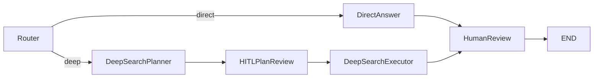
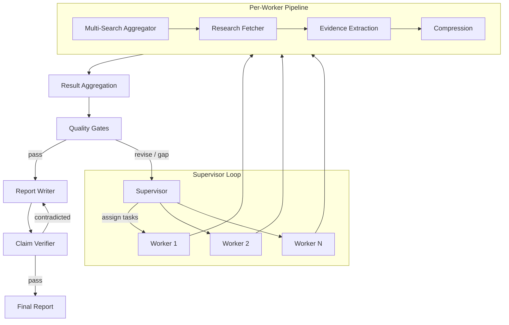
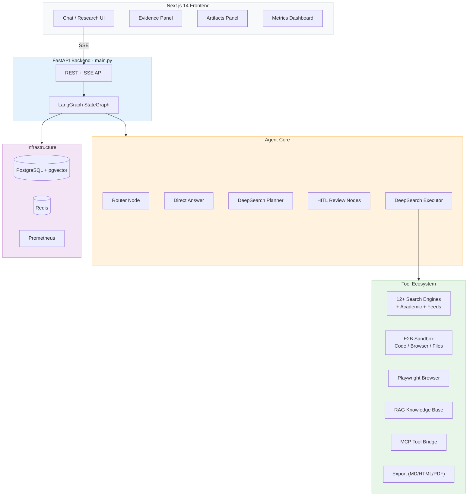

# Weaver — AI Deep Research Platform

<div align="right">
  <strong>Language / 语言:</strong>
  <strong>English</strong> |
  <a href="../README.md">简体中文</a>
</div>

<div align="center">

**Full-stack AI Deep Research platform built on LangGraph · Supervisor-Workers multi-round research · Multi-source aggregated search · Evidence traceability · HITL human-in-the-loop**

[](../LICENSE)
[](https://www.python.org/downloads/)
[](https://fastapi.tiangolo.com/)
[](https://github.com/langchain-ai/langgraph)
[](https://nextjs.org/)

[Report Bug](https://github.com/LittleSongxx/Weaver_pro/issues) · [Request Feature](https://github.com/LittleSongxx/Weaver_pro/issues)


</div>

---

## Table of Contents

- [Overview](#overview)
- [Core Features](#core-features)
- [Architecture](#architecture)
- [Project Structure](#project-structure)
- [Quick Start](#quick-start)
- [Configuration](#configuration)
- [API Reference](#api-reference)
- [Tool Ecosystem](#tool-ecosystem)
- [Development](#development)
- [Deployment](#deployment)
- [License](#license)

---

## Overview

Weaver is a full-stack AI platform focused on **deep research**. Its core capability is automated complex information investigation: starting from a user query, it performs multi-round parallel search, evidence fetching, claim verification, and generates structured research reports with citations. It also integrates sandbox code execution, browser automation, RAG knowledge base, and MCP tool bridge capabilities.

---

## Core Features

### Deep Research Engine

- **Plan-and-Execute**: Supervisor distributes sub-tasks → multiple Workers search in parallel → iterates until quality gates pass
- **5 DeepSearch modes**: `supervisor_workers` (default) · `auto` · `tree` · `linear` · `reflection_loop`
- **Evidence verification**: Claim Verifier per-statement verification · Evidence Passages paragraph-level grounding · Citation Gate coverage threshold · Fact Cards structured evidence
- **Quality gates**: Citation coverage · Claim contradiction/unsupported limits · Knowledge gap analysis · Source quality scoring
- **HITL checkpoints**: Research plan review (`hitl_plan_review`) + final report review (`human_review`), users can edit/approve/reject during the flow

### Multi-Source Aggregated Search

- **12+ search engines**: Tavily · Bocha · DuckDuckGo · Serper · SerpAPI · Bing · Google CSE · Exa · Firecrawl
- **Academic sources**: arXiv · PubMed · Semantic Scholar
- **Social feeds**: Twitter/X · Reddit · HackerNews
- **Search strategies**: `fallback` · `parallel` · `round_robin` · `best_first`
- **Reliability**: Per-provider retry + circuit breaker + freshness-aware ranking
- **Caching**: LRU + TTL session-level search cache with fuzzy query deduplication

### Multi-Model Support

- **Providers**: OpenAI / DeepSeek / Anthropic / Azure / Ollama (ChatOpenAI-compatible)
- **Task-based routing**: Different models for routing, planning, query generation, research, writing, evaluation
- **Fallback chains**: Automatic fallback when primary model unavailable

### Tool Ecosystem

| Category | Tools |
|----------|-------|
| **Sandbox (E2B)** | Browser automation · File operations · Shell commands · Excel/PPT generation · Image editing · Web dev · Vision |
| **Browser** | Playwright native automation · CDP screencast · Content extraction |
| **Automation** | Computer use (mouse/keyboard) · Bash · Task list |
| **Code** | Python execution (sandboxed) |
| **RAG** | Document upload → ChromaDB vectorization → automatic retrieval during research |
| **Export** | Markdown / HTML / PDF with Jinja2 templates |
| **Voice** | DashScope ASR (speech recognition) + TTS (text-to-speech) |
| **MCP** | Model Context Protocol bridge (filesystem / memory / git / postgres) |

### Skills

10 built-in skill profiles: `deep-researcher` · `data-analyst` · `competitive-analyst` · `code-assistant` · `writing-assistant` · `translator` · `finance-calculator` · `ppt-maker` · `web-scraper` · `mindmap-generator`

### Session & Collaboration

- PostgreSQL persistent sessions with LangGraph checkpointer
- Session resume / continue-research / share / comments / version snapshots
- SSE real-time streaming (research progress, search results, tool calls, quality metrics)
- Report export (Markdown / HTML / PDF)

---

## Architecture

### Research Graph (LangGraph StateGraph)



**Defined in** `agent/core/graph.py`. The graph has two main paths:
- **Direct**: Router → Direct Answer → Human Review → END
- **Deep Research**: Router → DeepSearch Planner → HITL Plan Review → DeepSearch Executor → Human Review → END

### DeepSearch Engine (Supervisor-Workers)



**Defined in** `agent/workflows/deepsearch_optimized.py` (250K+ lines) and `agent/workflows/supervisor_workers.py`.

### Full System Architecture



### Request Flow

```
Frontend (useChatStream.ts)
  → POST /api/research/sse or /api/chat/sse
    → main.py: stream_agent_events()
      → research_graph.astream_events()
        → Router Node → (Direct Answer | DeepSearch)
          → Tool execution / Search / Fetch
        → SSE event translation
      ← SSE frames
    ← StreamingResponse
  ← Frontend incremental rendering
```

---

## Project Structure

```
Weaver/
├── main.py                         # FastAPI entry (5000+ lines, all API endpoints)
├── agent/                          # LangGraph Agent core
│   ├── core/                       # Graph, state, events, context, middleware
│   │   ├── graph.py                # StateGraph: router → planner → HITL → executor → review
│   │   ├── state.py                # AgentState (routing/research/quality/tree/metrics fields)
│   │   ├── events.py               # SSE event emission
│   │   ├── context_manager.py      # Token counting & truncation
│   │   ├── multi_model.py          # Multi-model routing (by task type)
│   │   ├── middleware.py           # Observation masking, token recovery, tool limits
│   │   └── reflexion.py            # Self-reflection feedback
│   └── workflows/                  # Workflow implementations (60+ modules)
│       ├── nodes.py                # All graph nodes (router/direct/deepsearch/HITL)
│       ├── deepsearch_optimized.py # Main DeepSearch engine (250K+)
│       ├── supervisor_workers.py   # Supervisor-Workers orchestration
│       ├── research_tree.py        # Tree-based exploration
│       ├── claim_verifier.py       # Claim verification
│       ├── quality_gates.py        # Quality gates
│       ├── knowledge_gap.py        # Knowledge gap analysis
│       ├── research_brief.py       # Research brief generation
│       ├── domain_router.py        # Domain routing (scientific/legal/financial)
│       ├── fact_cards.py           # Structured fact cards
│       ├── citation_artifacts.py   # Citation annotation
│       └── agents/                 # Hierarchical agents (coordinator/planner/researcher/reporter)
├── tools/                          # Tool implementations
│   ├── search/                     # Multi-source aggregated search
│   │   ├── multi_search.py         # Search orchestration (fallback/parallel/round_robin)
│   │   ├── providers.py            # Bocha/Serper/SerpAPI/Bing/GoogleCSE/Exa/Firecrawl
│   │   ├── academic/               # arXiv / PubMed / Semantic Scholar
│   │   ├── feeds/                  # Twitter / Reddit / HackerNews
│   │   └── reliability.py          # Retry + circuit breaker
│   ├── sandbox/                    # E2B sandbox (14 modules: browser/files/shell/sheets/PPT/image/etc.)
│   ├── browser/                    # Playwright browser + CDP screencast
│   ├── automation/                 # Desktop automation (computer_use / bash / task_list)
│   ├── code/                       # Python code execution
│   ├── rag/                        # RAG (document loader / embedder / ChromaDB vector store)
│   ├── export/                     # Report export (Markdown → HTML/PDF, Jinja2 templates)
│   ├── io/                         # Voice I/O (DashScope ASR / TTS)
│   ├── crawl/                      # URL crawling (Playwright + crawl4ai)
│   └── core/                       # Tool registry, MCP bridge, memory client
├── common/                         # Shared infrastructure
│   ├── config.py                   # Pydantic Settings (350+ env vars)
│   ├── session_manager.py          # Session management (PostgreSQL persistence)
│   ├── cancellation.py             # Task cancellation (token-based)
│   ├── collaboration.py            # Share / comments / version snapshots
│   ├── tracing.py                  # Call chain tracing
│   └── evidence_store.py           # Evidence snapshot construction
├── triggers/                       # Triggers (Cron / Webhook / Event)
├── prompts/templates/              # 22 prompt templates
├── skills/                         # 10 skill profiles (.md)
├── web/                            # Next.js 14 frontend
│   ├── components/chat/            # Chat UI / Evidence Panel / Artifacts / Metrics
│   ├── components/research/        # Research Workspace
│   ├── hooks/useChatStream.ts      # SSE streaming
│   └── lib/api-types.ts            # Auto-generated TS types from OpenAPI
├── sdk/                            # Internal SDKs (TypeScript + Python)
├── eval/                           # Evaluation system (Deep Research Benchmark)
├── docker/                         # Docker Compose (PostgreSQL + Redis + Backend + Frontend)
├── scripts/                        # Dev/test/benchmark scripts
└── tests/                          # Test suite
```

---

## Quick Start

### Option 1: One-command start (recommended)

```bash
git clone https://github.com/LittleSongxx/Weaver_pro.git
cd Weaver_pro

# Auto-generates .env / web/.env.local / config/config.toml on first run
./start_weaver.sh
```

Fill in at least these keys in `.env`:

```bash
OPENAI_API_KEY=sk-...                     # Required (or DeepSeek-compatible key)
OPENAI_BASE_URL=https://api.deepseek.com  # For DeepSeek
BOCHA_API_KEY=                             # Recommended (Chinese search)
E2B_API_KEY=e2b_...                        # Optional (sandbox code execution)
```

### Option 2: Manual development setup

```bash
# Backend
make setup          # Creates .venv, installs requirements.txt + requirements-dev.txt
make setup-full     # Also installs requirements-optional.txt

# Frontend
pnpm -C web install --frozen-lockfile

# Start
make dev            # Backend on port 8001
pnpm -C web dev     # Frontend on port 3100
```

### Access Points

| Service | URL |
|---------|-----|
| Web UI | `http://127.0.0.1:3100` |
| Backend API | `http://127.0.0.1:8001` |
| OpenAPI Docs | `http://127.0.0.1:8001/docs` |
| Prometheus Metrics | `http://127.0.0.1:8001/metrics` |

---

## Configuration

### Key Environment Variables

Weaver uses 350+ environment variables configured via `.env`. See `.env.example` for the full list with comments.

#### Models

```bash
OPENAI_API_KEY=sk-...
OPENAI_BASE_URL=https://api.deepseek.com
PRIMARY_MODEL=deepseek-v4-flash           # Main chat/writing model
REASONING_MODEL=deepseek-v4-pro           # Planning/reasoning model (fallback: PRIMARY_MODEL)
ANTHROPIC_API_KEY=sk-ant-...              # Optional
USE_AZURE=false
```

#### Search Engines

```bash
SEARCH_ENGINES=tavily,bocha               # Priority order (comma-separated)
TAVILY_API_KEY=tvly-...                   # Or TAVILY_API_KEYS for key pool rotation
BOCHA_API_KEY=...
SERPER_API_KEY=...                        # Optional
BRAVE_API_KEY=...                         # Optional
EXA_API_KEY=...                           # Optional
# ... see .env.example for all providers
```

#### DeepSearch

```bash
DEEPSEARCH_MODE=supervisor_workers        # supervisor_workers|auto|tree|linear|reflection_loop
DEEPSEARCH_MAX_EPOCHS=3
DEEPSEARCH_QUERY_NUM=5
DEEPSEARCH_RESULTS_PER_QUERY=5
DEEPSEARCH_REPORT_SOURCES_LIMIT=30
DEEPSEARCH_ENABLE_RESEARCH_FETCHER=true
CITATION_GATE_MIN_COVERAGE=0.6
```

#### Search Orchestration

```bash
SEARCH_STRATEGY=fallback                  # fallback|parallel|round_robin|best_first
SEARCH_ENABLE_FRESHNESS_RANKING=true
SEARCH_CACHE_MAX_SIZE=200
SEARCH_CACHE_TTL_SECONDS=1800
SEARCH_RELIABILITY_CIRCUIT_BREAKER_FAILURES=3
```

#### Infrastructure

```bash
DATABASE_URL=postgresql://...             # Empty = in-memory checkpointer
MEMORY_STORE_BACKEND=memory               # memory|postgres|redis
PORT=8001
CORS_ORIGINS=http://localhost:3000,http://localhost:3100
```

---

## API Reference

### Research SSE (Primary Endpoint)

**POST** `/api/research/sse`

```json
{
  "query": "Analyze the current state of AI Agent frameworks",
  "search_mode": "deep",
  "model": "deepseek-v4-flash",
  "user_id": "user_123",
  "images": [],
  "deepsearch_config": {},
  "research_brief": {}
}
```

Returns `text/event-stream` with typed SSE events:

| Event | Description |
|-------|-------------|
| `brief_created` | Research brief + source routing preview |
| `status` | Status update (step, progress) |
| `text` | Streaming text chunk |
| `search` | Search execution (query, provider, results) |
| `tool_start` / `tool_result` / `tool_error` | Tool lifecycle |
| `quality_update` | Quality diagnostics (coverage, freshness, claims) |
| `research_tree_update` | Research tree snapshot |
| `artifact` | Generated artifact (chart, code, table) |
| `completion` | Final report |
| `interrupt` | HITL checkpoint (plan review / final review) |
| `cancelled` | Task cancelled |
| `error` | Error |
| `done` | Stream complete |

### Chat SSE

**POST** `/api/chat/sse` — Same schema as research, for chat-mode interactions.

### Session Management

| Method | Endpoint | Description |
|--------|----------|-------------|
| GET | `/api/sessions` | List sessions |
| GET | `/api/sessions/{thread_id}` | Get session info |
| GET | `/api/sessions/{thread_id}/state` | Full state snapshot |
| GET | `/api/sessions/{thread_id}/evidence` | Evidence artifacts (sources + claims + quality) |
| POST | `/api/sessions/{thread_id}/continue-research` | Continue research on existing session |
| POST | `/api/sessions/{thread_id}/resume` | Resume paused session |
| DELETE | `/api/sessions/{thread_id}` | Delete session |

### Collaboration

| Method | Endpoint | Description |
|--------|----------|-------------|
| POST | `/api/sessions/{thread_id}/share` | Create share link |
| GET | `/api/share/{share_id}` | Get shared session |
| POST | `/api/sessions/{thread_id}/comments` | Add comment |
| GET | `/api/sessions/{thread_id}/comments` | List comments |
| POST | `/api/sessions/{thread_id}/versions` | Create version snapshot |
| GET | `/api/sessions/{thread_id}/versions` | List versions |

### HITL Interrupts

| Method | Endpoint | Description |
|--------|----------|-------------|
| GET | `/api/interrupt/{thread_id}/status` | Check interrupt status |
| POST | `/api/interrupt/{thread_id}/resume` | Resume (approve/modify/reject/skip) |

### Export

| Method | Endpoint | Description |
|--------|----------|-------------|
| GET | `/api/export/templates` | List export templates |
| GET | `/api/export/{thread_id}?format=pdf` | Export report (markdown/html/pdf) |

### Other Endpoints

| Method | Endpoint | Description |
|--------|----------|-------------|
| POST | `/api/research/cancel/{thread_id}` | Cancel running task |
| GET | `/api/tools/registry` | Tool registry stats |
| GET | `/api/search/providers` | Search provider health |
| GET | `/api/search/cache/stats` | Search cache stats |
| GET | `/api/runs/{thread_id}` | Run metrics |
| GET | `/api/traces/{thread_id}` | Execution traces |
| POST | `/api/documents/upload` | Upload to RAG |
| GET | `/api/config/public` | Public runtime config |
| GET | `/api/memory/status` | Memory backend status |
| GET | `/metrics` | Prometheus metrics |

---

## Tool Ecosystem

### Search (16 modules)

```
tools/search/
├── multi_search.py              # Orchestrator (fallback/parallel/round_robin/best_first)
├── providers.py                 # Bocha · Serper · SerpAPI · Bing · Google CSE · Exa · Firecrawl
├── search.py                    # Tavily search
├── search_enhanced.py           # Enhanced search with snippets
├── fallback_search.py           # DuckDuckGo fallback
├── tavily_key_pool.py           # Multi-key rotation on quota exhaustion
├── reliability.py               # Retry + circuit breaker
├── academic/
│   ├── arxiv_provider.py        # arXiv API
│   ├── pubmed_provider.py       # PubMed/NCBI Entrez
│   └── semantic_scholar_provider.py
└── feeds/
    ├── twitter_provider.py      # Twitter/X API v2
    ├── reddit_provider.py       # Reddit API (PRAW)
    └── hackernews_provider.py   # HackerNews
```

### Sandbox (14 modules via E2B)

Browser session · Browser tools · Files · Shell · Excel/CSV · PowerPoint · Vision/OCR · Image editing · Web search · Web dev · Presentation v2

### Browser (6 modules)

Playwright native automation · Session management · Content extraction · CDP screencast · Browser-use events

### Other Tools

- **automation/**: Computer use · Bash · Task list · Ask human · String replace
- **code/**: Python code executor
- **rag/**: Document loader · Embedder · ChromaDB vector store · RAG tool
- **export/**: Markdown converter · Jinja2 templates (HTML/PDF)
- **io/**: ASR · TTS · Screenshot service
- **crawl/**: Playwright crawler · crawl4ai integration
- **core/**: Tool registry · MCP clients/policy · Memory client · LangChain adapter

---

## Development

### Makefile Targets

```bash
make setup          # Create venv + install deps
make setup-full     # + optional deps
make dev            # Start backend
make dev-reload     # Backend with hot reload
make test           # pytest
make lint           # ruff (changed files)
make lint-all       # ruff (full repo)
make format         # ruff formatter
make secret-scan    # Scan for leaked keys
make check          # lint + test + secret scan
make openapi-types  # Regenerate TS types from OpenAPI
make bench-smoke    # Benchmark smoke test
make web-install    # pnpm install
make web-lint       # Frontend lint
make web-build      # Frontend build
```

### Testing

```bash
make test                                    # All tests
python -m pytest tests/ -v                   # Verbose
python scripts/smoke_test_api.py             # API smoke test
python scripts/live_api_smoke.py --ws        # Live API + WebSocket
python scripts/deep_search_routing_check.py  # DeepSearch routing
```

### Benchmark

```bash
python scripts/benchmark_deep_research.py \
  --max-cases 3 \
  --mode supervisor_workers \
  --output /tmp/bench.json
```

- Sample tasks: `eval/benchmarks/sample_tasks.jsonl`
- Golden baseline: `eval/golden_queries.json`
- Full benchmark docs: [docs/benchmarks/README.md](benchmarks/README.md)
- Evaluation system: [eval/deep_research_benchmark/README.md](../eval/deep_research_benchmark/README.md)

---

## Deployment

### Docker Compose (recommended)

```bash
docker compose -f docker/docker-compose.yml up -d
```

Services: PostgreSQL 16 (pgvector) · Redis 7 · FastAPI backend · Next.js frontend

### Manual

```bash
# Backend
uvicorn main:app --host 0.0.0.0 --port 8001

# Frontend
pnpm -C web build && pnpm -C web start
```

### Security Hardening

```bash
WEAVER_INTERNAL_API_KEY=...               # API key for all /api/* endpoints
WEAVER_AUTH_USER_HEADER=X-Weaver-User     # User identity header (set by reverse proxy)
RATE_LIMIT_ENABLED=true                   # HTTP rate limiting
RATE_LIMIT_GENERAL_PER_MINUTE=60
RATE_LIMIT_RESEARCH_PER_MINUTE=20
```

---

## Tech Stack

| Layer | Technology |
|-------|-----------|
| **Backend** | FastAPI 0.134 · Uvicorn · Python 3.11+ |
| **Agent** | LangGraph 1.0+ · LangChain 1.0+ |
| **LLM** | OpenAI / DeepSeek / Anthropic / Azure / Ollama |
| **Database** | PostgreSQL 16 (pgvector) · Redis 7 |
| **Search** | Tavily · Bocha · DuckDuckGo · Serper · Bing · Exa · Google CSE · Firecrawl |
| **Academic** | arXiv · PubMed · Semantic Scholar |
| **Sandbox** | E2B Code Interpreter |
| **Browser** | Playwright 1.47+ |
| **RAG** | ChromaDB · PyMuPDF · python-docx |
| **Frontend** | Next.js 14 · React 18 · Tailwind CSS · Shadcn UI · Lucide Icons |
| **Export** | WeasyPrint (PDF) · Jinja2 · Markdown |
| **Observability** | Prometheus · Structured logging |

---

## Contributing

See [CONTRIBUTING.md](../CONTRIBUTING.md) for guidelines.

```bash
git clone https://github.com/LittleSongxx/Weaver_pro.git
cd Weaver_pro
make setup
make test
```

Code style: Ruff for linting/formatting · Type hints · Tests for new features.

---

## License

MIT License — see [LICENSE](../LICENSE).

---

<div align="center">

**[⬆ Back to Top](#weaver--ai-deep-research-platform)**

</div>
