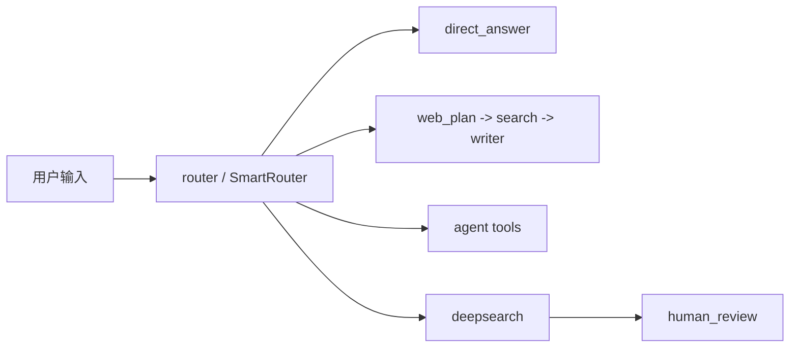
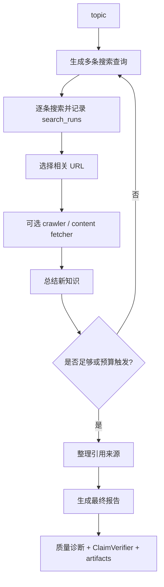
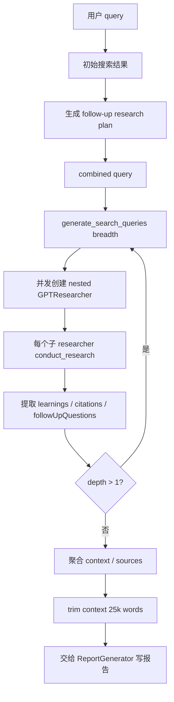
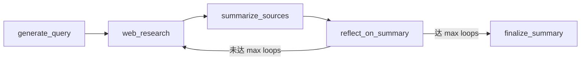

# Deep Research 三项目对比分析报告

本文档分析 Weaver、gpt-researcher、local-deep-researcher 三个项目的 Deep Research 实现，并结合 OpenAI Deep Research API、LangChain Open Deep Research、Agentic RAG survey、Anthropic think tool 等资料，提炼 Weaver 可参考的设计方向。

## 结论摘要

Weaver 当前的 Deep Research 不是“从零补功能”，而是已经具备大量先进组件后，需要进一步完成策略收敛、证据标准化、上下文工程、端到端评测和产品化体验的系统整合。

- **Weaver 的优势**：平台型能力强，已有 LangGraph 路由、线性/树状 DeepSearch、多搜索聚合、质量诊断、ClaimVerifier、预算守卫、研究事件流、RAG 模块、导出模块、评测脚本和部分层级协调器。
- **gpt-researcher 的优势**：研究产品链路完整，递归 breadth/depth 模型清晰，支持标准研究、深度研究、本地文档、向量库、混合来源、MCP 传播和多格式导出。
- **local-deep-researcher 的优势**：实现极简，反思式迭代闭环清晰，本地模型适配友好，适合作为 Weaver 的轻量模式和本地部署模式参考。
- **前沿共识**：Deep Research 的关键不只是“更多搜索”，而是 Scope/Brief、策略选择、上下文隔离、证据清洗、过程级可观测、严格预算和可点击引用。
- **Weaver 的主要机会**：把已有模块统一为一个“证据驱动、策略自适应、可评测”的 Deep Research 产品链路。

最终建议是：Weaver 不应照搬 gpt-researcher 的递归 researcher，也不应退化到 local-deep-researcher 的单循环；更适合演进为“brief-driven supervisor + isolated research branches + unified evidence layer + one-shot final writer + process-level evaluation”的平台型 Deep Research。

## 分析范围

### Weaver

重点阅读：

- `agent/core/graph.py`
- `agent/workflows/nodes.py`
- `agent/workflows/deepsearch_optimized.py`
- `agent/workflows/research_tree.py`
- `tools/search/multi_search.py`
- `agent/workflows/quality_assessor.py`
- `agent/workflows/claim_verifier.py`
- `agent/workflows/compressor.py`
- `tools/rag/*.py`
- `tools/export/markdown_converter.py`
- `docs/benchmarks/README.md`
- `scripts/benchmark_deep_research.py`

### gpt-researcher

重点阅读：

- `gpt_researcher/agent.py`
- `gpt_researcher/skills/deep_research.py`
- `gpt_researcher/skills/researcher.py`
- `gpt_researcher/skills/writer.py`
- `gpt_researcher/actions/query_processing.py`
- `gpt_researcher/actions/report_generation.py`
- `docs/docs/gpt-researcher/gptr/deep_research.md`

### local-deep-researcher

重点阅读：

- `src/ollama_deep_researcher/graph.py`
- `src/ollama_deep_researcher/configuration.py`
- `src/ollama_deep_researcher/state.py`
- `src/ollama_deep_researcher/prompts.py`
- `src/ollama_deep_researcher/utils.py`
- `README.md`

### 外部资料

参考资料包括：

- OpenAI Deep Research API 文档与 Cookbook。
- LangChain Open Deep Research 博文。
- Agentic Retrieval-Augmented Generation: A Survey on Agentic RAG。
- Anthropic “think tool” 工程实践。

OpenAI 官网介绍页在本次抓取时返回 Forbidden，因此未直接引用该页面正文；本文优先依据可访问的 OpenAI API 文档和 Cookbook 内容。

## Weaver 当前架构分析

### 入口与路由

Weaver 的执行入口位于 `agent/core/graph.py`。主图从 `router` 开始，按 `route` 选择 `direct_answer`、`web_plan`、`agent`、`deepsearch` 或 `clarify`。

`agent/workflows/nodes.py` 中的 `route_node` 使用 `smart_route`，同时支持显式 `search_mode` override。Deep Research 对应 `deepsearch_node`，该节点最终调用 `run_deepsearch_auto`。

### DeepSearch 自动模式

`agent/workflows/deepsearch_optimized.py` 定义三条关键路径：

- **`run_deepsearch_optimized`**：线性多轮迭代。
- **`run_deepsearch_tree`**：树状探索。
- **`run_deepsearch_auto`**：按配置和问题复杂度选择 tree 或 linear。

自动模式的主要逻辑：

- 如果 `deepsearch_mode=tree`，强制树状探索。
- 如果 `deepsearch_mode=linear`，强制线性探索。
- 如果 `auto` 且问题是简单事实型，走低成本线性短路径。
- 否则在 `tree_exploration_enabled=true` 时走树状探索。

### 线性 DeepSearch

线性路径的流程大致为：

关键能力：

- **多模型路由**：planning、research、writing 可使用不同模型。
- **查询去重**：`have_query` 避免重复搜索。
- **URL 去重**：canonical URL + set，降低重复爬取。
- **预算守卫**：支持 `deepsearch_max_seconds`、`deepsearch_max_tokens`。
- **知识空白分析**：`KnowledgeGapAnalyzer` 可影响下一轮查询。
- **新鲜度诊断**：针对 time-sensitive query 给出 freshness warning。
- **引用和证据**：`_format_sources_for_writer`、`_append_auto_references`、`ClaimVerifier`、`passages`。
- **事件流**：发出 search、quality_update、research_node_complete 等事件。

### 树状 DeepSearch

`research_tree.py` 中的 `TreeExplorer` 负责：

- root topic 搜索。
- topic decomposition。
- branch exploration。
- async parallel exploration。
- branch summary。
- branch merge。
- LATS-style scoring/backtracking。

树状路径适合多维比较、多子话题综述和需要覆盖面的问题。

潜在问题：

- **证据对象不统一**：树节点的发现、线性路径的 search runs、RAG 结果和 fetched passages 仍未完全收敛到同一种 evidence schema。
- **质量问题可能被 fallback 掩盖**：`run_deepsearch_tree` 失败后 fallback 到线性路径，容错好，但可能隐藏树模式质量回归。
- **策略调参仍偏静态**：分支数、深度、queries per branch 已可配置，但尚未充分由 brief、领域、预算和质量指标动态决定。

### 搜索聚合

`tools/search/multi_search.py` 已提供较完整的多搜索设计：

- Provider 抽象。
- `fallback`、`parallel`、`round_robin`、`best_first` 策略。
- URL canonicalization。
- Provider stats 和 health。
- 可靠性、重试、熔断、并行 worker 配置。
- freshness ranking 配置。

这说明 Weaver 不缺“多搜索模块”，更缺的是对不同领域选择 provider profile 的端到端验证、对来源质量的稳定评分、以及搜索结果与本地 RAG、MCP、页面 fetch 的统一融合。

### RAG 与私有知识

Weaver 已有 `tools/rag` 模块：

- `DocumentLoader` 支持 PDF、DOCX、TXT、MD。
- `Embedder` 使用 embedding 模型。
- `VectorStore` 使用 ChromaDB。
- `RAGTool` 提供 add/search/list/delete/count。
- `rag_search` 是 LangChain-compatible tool。

当前判断：

- Weaver 已经具备 RAG 基础能力。
- 但 DeepSearch 主流程中，RAG 还不是像 web search 一样的一等 evidence provider。
- 与 gpt-researcher 的 Local/Hybrid/VectorStore report source 相比，Weaver 需要更明确地支持“本地文档 + Web + MCP”统一检索与统一引用。

### 质量与评测

Weaver 在质量控制上已有明显投入：

- `quality_assessor.py`：claim support、source diversity、contradiction、citation accuracy、citation coverage。
- `claim_verifier.py`：确定性 claim-to-evidence matcher。
- `deepsearch_optimized.py`：query coverage、freshness summary、citation coverage、claim verifier stats。
- `docs/benchmarks/README.md` 和 `scripts/benchmark_deep_research.py`：支持 smoke benchmark 和真实 SSE 执行 benchmark。

这是 Weaver 相对 gpt-researcher/local-deep-researcher 的强项。需要补强的是：质量指标应从“附加 diagnostics”升级为“驱动策略选择和下一步行动的控制信号”。

### 导出与报告产品化

Weaver 已有 `tools/export/markdown_converter.py`，支持 HTML template、PDF、DOCX 和 HTML 转换。但相对 gpt-researcher 的 CLI 一体化输出，Weaver 仍需要打通后端 API、前端导出入口、报告 artifact 管理，以及引用/图表/来源列表在导出文件中的一致渲染。

## gpt-researcher 深度分析

### 主入口

`GPTResearcher` 在 `agent.py` 初始化核心组件：

- retrievers。
- memory。
- `ResearchConductor`。
- `ReportGenerator`。
- `ContextManager`。
- `BrowserManager`。
- `SourceCurator`。
- `DeepResearchSkill`。

当 `report_type == ReportType.DeepResearch.value` 时，`conduct_research` 会走 `_handle_deep_research`，由 `DeepResearchSkill.run()` 生成上下文，再由 `write_report()` 生成最终报告。

### DeepResearchSkill 流程

`skills/deep_research.py` 的核心是递归 breadth/depth：

### gpt-researcher 值得 Weaver 学习的点

- **nested researcher 复用**：每个分支复用标准研究流程，而不是为 Deep Research 写完全独立的逻辑。
- **breadth/depth 参数清晰**：对用户和运维都容易理解。
- **本地/混合数据源成熟**：`ResearchConductor` 支持 Web、Local、Hybrid、Azure、LangChainDocuments、LangChainVectorStore。
- **导出链路完整**：CLI 直接生成 Markdown、PDF、DOCX。
- **MCP 传播策略**：nested researcher 会传递 `mcp_configs` 和 `mcp_strategy`。
- **进度跟踪**：`ResearchProgress` 明确 current_depth、current_breadth、current_query、completed_queries。

### gpt-researcher 的局限

- **文本解析脆弱**：`Query:`、`Goal:`、`Learning:`、`Question:` 依赖 LLM 格式遵循。
- **成本和延迟高**：每个 query 都创建 nested researcher，递归展开成本较高。
- **证据结构不够强**：learnings/citations 聚合较自由，缺少统一 evidence object 和 claim-level verification。
- **质量闭环弱于 Weaver**：没有 Weaver 这类 query coverage、freshness、claim verifier、benchmark 控制信号。

### gpt-researcher 对 Weaver 的启发

Weaver 不必复制 nested researcher 的完整成本结构，但可以借鉴其清晰的 `breadth/depth/concurrency` 用户模型，以及将 Deep Research 分支复用标准研究能力的设计。更重要的是，gpt-researcher 的 Local/Hybrid/VectorStore source model 可以帮助 Weaver 把已有 RAG 模块提升为 DeepSearch 一等来源。

## local-deep-researcher 深度分析

### LangGraph 流程

`src/ollama_deep_researcher/graph.py` 的结构非常简洁，核心节点只有五个：

状态模型也极简：

- `research_topic`
- `search_query`
- `web_research_results`
- `sources_gathered`
- `research_loop_count`
- `running_summary`

### 搜索与总结机制

`configuration.py` 中可配置：

- `max_web_research_loops`
- `local_llm`
- `llm_provider`
- `search_api`
- `fetch_full_page`
- `strip_thinking_tokens`
- `use_tool_calling`

`utils.py` 提供 DuckDuckGo、SearXNG、Tavily、Perplexity 等搜索封装，并通过 `deduplicate_and_format_sources` 对来源按 URL 去重和格式化。`prompts.py` 则把任务拆成 query writer、summarizer、reflection 三类提示词。

### local-deep-researcher 值得 Weaver 学习的点

- **反思式迭代闭环清晰**：每轮总结后专门生成 knowledge gap 和 follow-up query。
- **本地模型友好**：支持 Ollama、LMStudio。
- **结构化输出双模式**：JSON mode 和 tool calling 可切换，适配不支持 JSON mode 的模型。
- **thinking token 清理**：对会输出 `<think>` 的模型友好。
- **搜索源轻量可配置**：DuckDuckGo 默认无 API key，SearXNG 支持自托管。

### local-deep-researcher 的局限

- **单查询循环**：每轮只有一个 follow-up query，覆盖面有限。
- **缺少并行和树状探索**：复杂比较或多维综述不够高效。
- **证据验证简单**：最终 summary 附 sources，但没有 claim-level grounding。
- **报告结构较弱**：更像 summary，不是完整研究报告产品。

### local-deep-researcher 对 Weaver 的启发

local-deep-researcher 适合作为 Weaver 的“轻量 DeepSearch / 本地模型 DeepSearch”参考。Weaver 可以保留现有 tree/linear 高级模式，同时提供一个低成本的 reflection loop 模式，用于本地模型、无 API key 搜索、快速事实补充和开发调试。

## 前沿技术调研提炼

### LangChain Open Deep Research

Open Deep Research 的关键架构是三阶段：

- **Scope**：澄清用户意图，生成 focused research brief。
- **Research**：supervisor 代理按 brief 拆分子任务，派发给 isolated sub-agents。
- **Write**：收集 cleaned findings 后 one-shot 写最终报告。

关键经验：

- **多智能体适合研究阶段，不适合并行写报告**：并行写报告章节容易风格割裂和逻辑不一致。
- **子话题上下文隔离能减少 context clash**：单 agent 同时处理多个独立主题时，工具反馈会互相污染。
- **sub-agent 应清洗自己的工具反馈**：把 raw tool output 直接交给 supervisor 会造成 token bloat。
- **supervisor 用于动态调整研究深度**：不是固定搜索轮次，而是按 brief 和已收集发现判断是否继续。

对 Weaver 的含义：

- Weaver 已有 coordinator 和 tree/hybrid 基础，可以演进为 brief-driven supervisor。
- 多智能体应主要用于检索与证据整理，最终写作保持统一 writer。
- TreeExplorer 的 branch summary 可以进一步标准化为 cleaned sub-agent finding。

### OpenAI Deep Research API

OpenAI Deep Research API 暴露了几个对 Weaver 很重要的产品化模式：

- **中间步骤可检查**：输出中包含 web search、code interpreter、MCP、file search 等调用记录。
- **最终答案带 inline citation annotations**：引用包含 URL、title、字符跨度，可用于 UI 高亮和可点击跳转。
- **长任务应后台化**：推荐 background mode、webhook 和更高 timeout。
- **工具调用应有上限**：通过 `max_tool_calls` 约束成本和延迟。
- **需要开发者处理澄清**：API 本身期望 fully-formed prompt，开发者可用 prompt rewriter 或 clarifier 补全研究任务。
- **私有数据通过 search/fetch MCP 接口接入**：MCP server 应提供 search 和 fetch 两个只读能力。

对 Weaver 的含义：

- Weaver 的 SSE 事件基础很好，但应进一步标准化 intermediate step schema。
- 引用不应只附在段末，还应可映射到具体文本 span。
- Deep Research 长任务应强化后台任务、恢复、webhook/notification 或可重连能力。
- 本地 RAG/MCP 应收敛为 search/fetch evidence provider 接口。

### Agentic RAG Survey

Agentic RAG survey 中与 Weaver 最相关的模式包括：

- **Prompt chaining**：复杂任务拆成多个固定步骤。
- **Routing**：不同问题进入不同专门流程。
- **Parallelization**：独立任务并行执行，降低延迟。
- **Orchestrator-workers**：中央协调者动态拆分任务并分配 worker。
- **Evaluator-optimizer**：通过评估器迭代优化输出。

实践建议：

- Agentic RAG 不应是所有问题的默认方案。
- 检索质量仍是最大瓶颈。
- 自主性必须有明确预算、工具策略和停止条件。
- 评测要覆盖过程，不只是最终答案。
- 领域知识和结构化约束能显著放大收益。
- 可解释、可追踪和审计应是一等目标。

对 Weaver 的含义：

- `direct/web/agent/deep` 路由方向正确，但还应更精细地选择 deep 内部策略。
- Weaver 的质量指标应驱动控制流，而不仅是事后展示。
- 域路由和 provider profile 值得继续投入。

### Anthropic think tool

Anthropic 的 think tool 经验对 Weaver 的 planner/coordinator 有参考价值：

- 给模型一个显式“停下来思考”的工具空间，适合复杂工具调用。
- 有效做法是在 system prompt 中说明何时使用、如何拆解、如何检查信息是否齐全。
- 对长而复杂的指导，放在 system prompt 中通常比放在 tool description 中更有效。

对 Weaver 的含义：

- 可以在 DeepSearch 的 planner/coordinator 中引入显式 reflection/think step。
- 该步骤不应让模型无限思考，而应用于阶段性检查：是否覆盖关键维度、是否缺证据、是否应停止、是否需要切换策略。

## 三项目能力矩阵

| 能力 | Weaver 当前状态 | gpt-researcher 参考 | local-deep-researcher 参考 | 建议 |
| --- | --- | --- | --- | --- |
| 用户意图澄清 | 有 clarify node，但 deep brief 不够中心化 | 初始 follow-up questions | 无交互澄清，直接 topic | 建立 Scope/Brief 阶段 |
| 策略路由 | direct/web/agent/deep + linear/tree auto | report_type/source_type | 固定循环 | 深化 deep 内策略选择 |
| 查询规划 | 多轮 query generation + gap topics | breadth queries + goals | 单 query + reflection | 统一 query plan schema |
| 树状探索 | 已实现 TreeExplorer | 递归 breadth/depth | 无 | 保留并加强证据约束 |
| 多智能体 | coordinator/hybrid 基础 | nested researcher | 无 | 用于研究，不用于并行写作 |
| 本地 RAG | 有模块和 tool，需一等集成 | Local/Hybrid/VectorStore 成熟 | 非核心 | 统一 web/RAG/MCP evidence provider |
| 搜索聚合 | 多 provider/策略设计较强 | 多 retriever | 多简单 provider | 加强 provider quality/rerank |
| 上下文压缩 | compressor + summary_notes | context manager / curator / trim | running summary | 建立层级 evidence digest |
| 引用证据 | source block + references + claim verifier | citations in learnings | sources list | 引入 span-level citations |
| 质量评估 | diagnostics + benchmark 较强 | 较弱 | 很弱 | 让质量信号驱动控制流 |
| 导出 | 模块存在，产品链路待打通 | CLI 完整导出 | Markdown summary | 打通 API/UI artifact |
| 可观测性 | SSE events + artifacts | websocket progress | LangGraph Studio | 标准化 intermediate step schema |
| 长任务可靠性 | 有取消/预算，需恢复增强 | async 流程 | LangGraph 本地运行 | 后台任务和可恢复会话 |

## 关键差距判断

### 差距一：缺少中心化 Research Brief

Weaver 目前有 SmartRouter、clarify、query generation 和 knowledge gap analysis，但 DeepSearch 主流程还没有一个贯穿全程的 research brief。Open Deep Research 和 OpenAI Cookbook 都强调：复杂研究任务需要在正式搜索前明确范围、约束、指标、来源偏好和输出格式。

影响：

- query generation 可能围绕原始输入局部展开，而不是围绕完整研究目标展开。
- final writer 不能稳定判断“是否真正完成任务”。
- benchmark 中 expected_fields 难以与运行时控制逻辑对齐。

### 差距二：Evidence Schema 尚未统一

Weaver 有 search runs、sources、fetched pages、passages、claims、RAG results 等多种结构，但还缺一个统一的 `EvidenceItem` 抽象。

理想结构应至少包含：

- `id`
- `source_type`
- `provider`
- `url` 或 `document_id`
- `title`
- `snippet`
- `raw_content_ref`
- `published_date`
- `retrieved_at`
- `quality_score`
- `freshness_score`
- `citation_id`
- `supporting_claims`

统一后，RAG、MCP、web search、page fetch、claim verification、citation rendering、export 都可以共享同一套证据结构。

### 差距三：质量指标没有充分驱动控制流

Weaver 已能输出 query coverage、freshness、citation coverage、claim verifier 统计，但这些指标更多是诊断和展示。下一步应让质量指标反向驱动：

- 是否继续搜索。
- 搜索哪个 gap。
- 是否切换 provider。
- 是否从 linear 升级到 tree。
- 是否补抓页面正文。
- 是否拒绝生成最终报告或标注低置信。

### 差距四：RAG/MCP 未成为 DeepSearch 一等来源

Weaver 已有 RAG tool 和 MCP 基础，但 DeepSearch 主路径仍以 web search 为核心。gpt-researcher 的 Local/Hybrid/VectorStore source 模型和 OpenAI 的 search/fetch MCP 模式都说明：私有知识应该作为一等 evidence provider。

### 差距五：报告产物链路未完全产品化

Weaver 已有 Markdown converter 和 report artifacts 的基础，但与 gpt-researcher 的 CLI 输出相比，仍需要打通：

- 报告保存。
- 前端下载。
- PDF/DOCX/HTML 导出。
- 引用列表一致渲染。
- 图表和证据附录。
- 质量诊断随报告导出。

### 差距六：长任务可靠性和恢复能力

OpenAI Deep Research API 推荐 background mode 和 webhook，是因为 Deep Research 可能运行数分钟到数十分钟。Weaver 已有 SSE、取消和预算，但还应增强：

- 任务后台化。
- 断线重连。
- 中间 artifacts 持久化。
- 可恢复/可继续研究。
- 运行后通知。

## 总体判断

Weaver 的 Deep Research 已经具备比 local-deep-researcher 更复杂的编排能力，也在质量诊断上超过 gpt-researcher 的当前实现。它真正需要补的是产品级一致性：

- 以 Research Brief 统一意图。
- 以 Evidence Schema 统一来源。
- 以 Quality Gates 统一控制流。
- 以 Artifacts 统一报告、引用、导出和前端展示。

完成这些后，Weaver 可以形成区别于两个参考项目的优势：既有 gpt-researcher 的完整研究产品能力，又有 local-deep-researcher 的可解释迭代闭环，同时保留自身平台型、多工具、多模型和可评测的特性。

## 参考来源摘要

### 源码依据

- **Weaver**：`agent/core/graph.py`、`agent/workflows/nodes.py`、`agent/workflows/deepsearch_optimized.py`、`agent/workflows/research_tree.py`、`tools/search/multi_search.py`、`agent/workflows/quality_assessor.py`、`agent/workflows/claim_verifier.py`、`tools/rag/*.py`、`tools/export/markdown_converter.py`。
- **gpt-researcher**：`gpt_researcher/agent.py`、`gpt_researcher/skills/deep_research.py`、`gpt_researcher/skills/researcher.py`、`gpt_researcher/skills/writer.py`、`gpt_researcher/actions/query_processing.py`、`gpt_researcher/actions/report_generation.py`。
- **local-deep-researcher**：`src/ollama_deep_researcher/graph.py`、`configuration.py`、`state.py`、`prompts.py`、`utils.py`。

### 外部资料依据

- **OpenAI Deep Research API / Cookbook**：用于提炼 background execution、intermediate steps、inline citations、prompt rewriting、MCP search/fetch 接口。
- **LangChain Open Deep Research**：用于提炼 Scope / Research / Write 三阶段、supervisor/sub-agent、上下文隔离和 one-shot final writing。
- **Agentic RAG Survey**：用于提炼 routing、parallelization、orchestrator-workers、evaluator-optimizer、过程级评测和自主性约束。
- **Anthropic think tool**：用于提炼显式 reflection/think step 在复杂工具调用中的工程价值。

## 最终建议

Weaver 的下一阶段目标不应是简单“加更多 agent”或“加更多搜索源”，而应是把已有能力统一成稳定的 Deep Research 产品内核：

- **Scope/Brief**：研究前明确任务边界、输出标准和来源策略。
- **Evidence Layer**：统一 Web、RAG、MCP、fetch、claims 和 citations。
- **Adaptive Strategy**：根据 brief、预算、质量指标动态选择 linear、tree、reflection loop 或 supervisor-workers。
- **Quality Gates**：用 query coverage、freshness、citation coverage、claim verifier 反向驱动控制流。
- **Artifacts**：将 final report、sources、citations、quality summary、intermediate steps、export files 标准化持久化。

这条路线可以让 Weaver 形成区别于 gpt-researcher 和 local-deep-researcher 的核心优势：更强的工程化质量控制、更好的平台集成能力，以及面向真实生产场景的可观测、可评测、可恢复 Deep Research。
