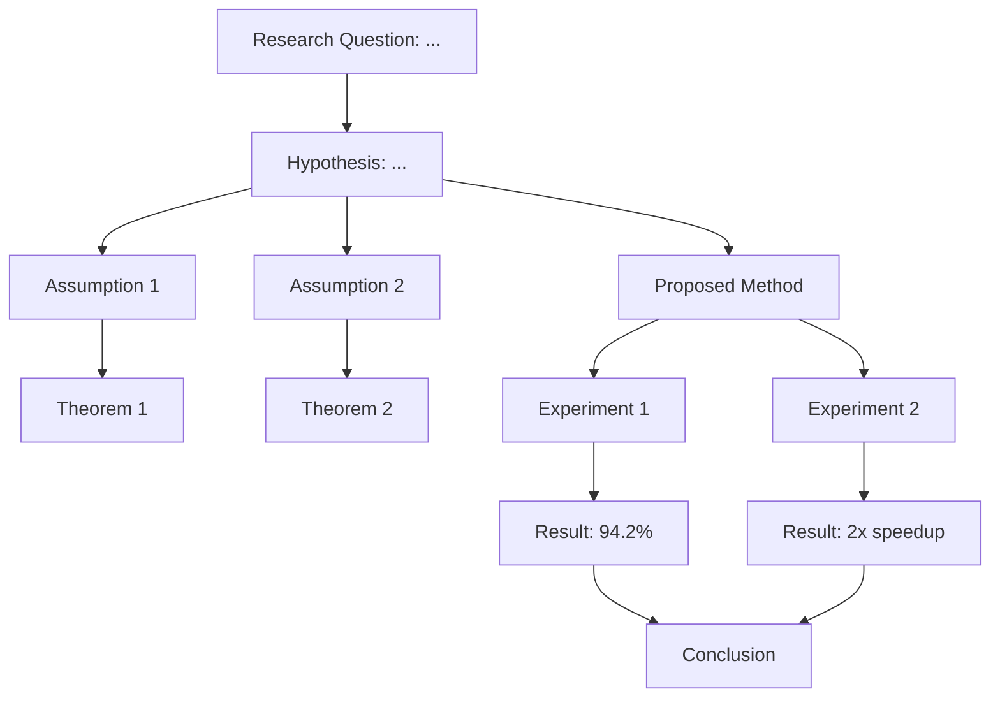

# Paper Decomposition Skill

## Overview

This skill decomposes academic papers into structured, machine-readable knowledge components. Unlike `academic-paper-review` (which evaluates paper quality) or `systematic-literature-review` (which synthesizes across papers), this skill focuses on **extracting the internal logical structure** of a single paper — its claims, their dependencies, the evidence chain, and the methodological pipeline.

The output is both human-readable markdown and a JSON knowledge graph that can be used for cross-paper linking, automated reasoning, and research QA.

## When to Use This Skill

**Use this skill when:**

- User wants to understand the detailed logical structure of a paper
- User asks "how does this paper's argument work?", "map out the claims", "extract the methodology pipeline"
- You need structured paper data for downstream cross-paper analysis
- User is building a knowledge base of papers
- User wants to compare the internal argument structures of multiple papers
- The `academic-paper-review` skill has been run and the user wants deeper structural analysis

**Do NOT use when:**

- User only wants a summary (use `academic-paper-review` with `--brief` or just read the abstract)
- User wants to evaluate the paper's quality (decomposition is descriptive, not evaluative)

## Workflow

### Phase 1: Structural Parsing

Extract the paper's rhetorical structure:

| Component | Description | Example |
|---|---|---|
| **Research Question** | The core question the paper addresses | "How can we reduce the memory footprint of transformer attention?" |
| **Hypothesis** | The paper's central conjecture | "Linear attention approximations can match quadratic attention accuracy" |
| **Problem Statement** | The gap or limitation being addressed | "Standard attention is O(n²) in sequence length" |
| **Proposed Method** | The solution or approach | "Kernel-based attention with random feature maps" |
| **Key Insight** | The crucial idea that makes it work | "Softmax can be approximated as a dot product in feature space" |
| **Theoretical Results** | Formal guarantees, bounds, proofs | "Linear attention approximates softmax within ε error with O(n·d²/ε²) features" |
| **Empirical Results** | Experimental findings | "2-5x speedup with <1% accuracy loss on GLUE benchmarks" |

Use the `extract_claims.py` script to get initial claim candidates, then annotate each with its rhetorical role.

### Phase 2: Claim Dependency Graph

Build a directed graph of how claims depend on each other:

```
Research Question
    └── Hypothesis
         ├── Assumption 1 → (supports) → Theoretical Result 1
         ├── Assumption 2 → (supports) → Theoretical Result 2
         └── Design Decision 1 → (implements) → Proposed Method
              └── Empirical Result 1 (validates) ← Experiment 1
              └── Empirical Result 2 (validates) ← Experiment 2
```

For each claim, identify:
- `claim_id`: unique identifier
- `claim_text`: the claim itself
- `claim_type`: (assumption, theoretical_result, empirical_result, design_decision, conclusion)
- `depends_on`: list of claim_ids this claim relies on
- `supports`: list of claim_ids this claim provides evidence for
- `strength`: (proven, supported_by_experiment, asserted, speculated)

### Phase 3: Methodology Pipeline

Extract the complete methodology as a pipeline:

```
Input Data → [Preprocessing] → [Model Architecture] → [Training] → [Evaluation] → Results

For each pipeline stage, extract:
- What specific operations are performed
- What parameters / hyperparameters are used
- What design choices are made (and why)
- What alternatives were considered but not chosen
```

### Phase 4: Evidence Graph

Map each empirical claim to its supporting evidence:

```
Claim: "Model achieves 94.2% accuracy on benchmark X"
  ├── Evidence: Table 2, row "Our Model", column "Benchmark X"
  │   ├── Type: quantitative
  │   ├── Comparison Baseline A: 92.1%
  │   ├── Comparison Baseline B: 91.5%
  │   └── Statistical Test: t-test p<0.01 vs both baselines
  └── Reproducibility: code provided at github.com/author/repo
```

For each piece of evidence, record:
- What it measures
- How it was measured (metric, dataset, protocol)
- Whether error bars / statistical tests are reported
- Whether code to reproduce it is available

### Phase 5: Output Generation

#### 5.1: Knowledge Graph (JSON)

Output a structured JSON knowledge graph:

```json
{
  "paper_id": "arxiv_2301.00001",
  "title": "...",
  "research_question": "...",
  "hypothesis": "...",
  "problem_statement": "...",
  "proposed_method": {
    "name": "...",
    "description": "...",
    "key_innovation": "...",
    "pipeline": ["Stage 1", "Stage 2", "..."],
    "design_decisions": [
      {"decision": "...", "rationale": "...", "alternatives_considered": ["..."]}
    ]
  },
  "claims": [
    {
      "claim_id": "claim_0001",
      "text": "...",
      "type": "empirical_result",
      "depends_on": ["claim_0005"],
      "supports": ["claim_0010"],
      "strength": "supported_by_experiment",
      "evidence": [
        {"type": "table", "location": "Table 2", "description": "..."}
      ]
    }
  ],
  "methodology_pipeline": [...],
  "datasets_used": [{"name": "...", "size": N, "task": "..."}],
  "baselines_compared": [{"name": "...", "result": X, "ours": Y}]
}
```

#### 5.2: Visual Map (Mermaid)

Generate a Mermaid diagram showing the paper's argument structure:



#### 5.3: Structured Summary (Markdown)

A human-readable decomposition report.

## Cross-Paper Linking

When decomposing multiple papers in the same domain, link them:

- Papers addressing the same research question → `same_rq`
- Papers using the same dataset → `shared_dataset`
- Papers that cite each other → `cites` / `cited_by`
- Papers proposing competing methods → `competes_with`
- Papers that extend/build on each other → `extends`

Store cross-paper links in a shared JSON file at `/mnt/user-data/outputs/paper_graph.json` (ensure `mkdir -p /mnt/user-data/outputs` before writing).

## Quality Checklist

- [ ] Research question and hypothesis clearly identified
- [ ] All major claims extracted and classified by type
- [ ] Claim dependency graph is internally consistent (no circular dependencies)
- [ ] Methodology pipeline is complete (input → output traceable)
- [ ] Evidence for each empirical claim is documented
- [ ] Mermaid diagram generated and syntactically correct
- [ ] JSON knowledge graph is valid and machine-readable
- [ ] When decomposing >1 paper, cross-paper links are recorded
- [ ] Output saved (ensure `mkdir -p /mnt/user-data/outputs`) to `/mnt/user-data/outputs/decomposition-{paper-slug}.md` and `.json`
