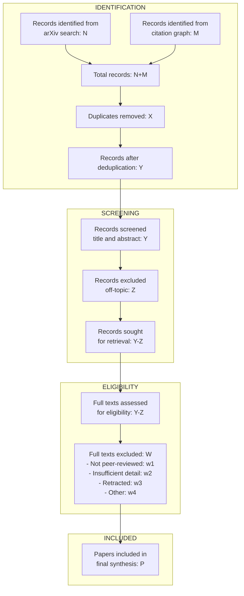

# PRISMA 2020 Quick Reference

Use this template when the user requests a PRISMA-compliant systematic review.

## PRISMA 2020 Checklist

| Section and Topic | Item # | Checklist Item | Location in Report |
|---|---|---|---|
| **TITLE** | 1 | Identify the report as a systematic review. | |
| **ABSTRACT** | 2 | See PRISMA 2020 for Abstracts checklist. | |
| **RATIONALE** | 3 | Describe the rationale for the review in the context of existing knowledge. | |
| **OBJECTIVES** | 4 | Provide an explicit statement of the objective(s) or question(s) the review addresses. | |
| **ELIGIBILITY CRITERIA** | 5 | Specify inclusion and exclusion criteria and how studies were grouped for synthesis. | |
| **INFORMATION SOURCES** | 6 | Specify all databases, registers, websites, organisations, reference lists, and other sources searched. Specify the date each source was last searched. | |
| **SEARCH STRATEGY** | 7 | Present the full search strategies for all databases, registers, and websites, including any filters and limits used. | |
| **SELECTION PROCESS** | 8 | Specify methods used to decide whether a study met the inclusion criteria, including how many reviewers screened each record. | |
| **DATA COLLECTION PROCESS** | 9 | Specify methods used to collect data from reports, including how many reviewers collected data from each report. | |
| **DATA ITEMS** | 10a | List and define all outcomes for which data were sought. Specify whether all results compatible with each outcome domain were sought. | |
| **RISK OF BIAS ASSESSMENT** | 11 | Specify methods used to assess risk of bias in included studies. | |
| **EFFECT MEASURES** | 12 | Specify for each outcome the effect measure(s) used (e.g., risk ratio, mean difference). | |
| **SYNTHESIS METHODS** | 13a-e | Describe processes used to decide which studies were eligible for each synthesis. Describe methods for preparing data, tabulating/displaying results, and synthesizing results. | |
| **REPORTING BIAS ASSESSMENT** | 14 | Describe methods used to assess risk of bias due to missing results. | |
| **CERTAINTY ASSESSMENT** | 15 | Describe methods used to assess certainty (or confidence) in the body of evidence for an outcome. | |
| **STUDY SELECTION** | 16a-b | Describe results of search and selection process (PRISMA flow diagram). Cite studies that met criteria and those excluded with reasons. | |
| **STUDY CHARACTERISTICS** | 17 | Cite each included study and present its characteristics. | |
| **RISK OF BIAS IN STUDIES** | 18 | Present assessments of risk of bias for each included study. | |
| **RESULTS OF INDIVIDUAL STUDIES** | 19 | For all outcomes, present summary statistics and effect estimates with confidence intervals. | |
| **RESULTS OF SYNTHESES** | 20a-d | Present results of all statistical syntheses and investigations of heterogeneity. | |
| **REPORTING BIASES** | 21 | Present assessments of risk of bias due to missing results. | |
| **CERTAINTY OF EVIDENCE** | 22 | Present assessments of certainty (or confidence) in the body of evidence. | |
| **DISCUSSION** | 23a-d | Provide a general interpretation in context of other evidence. Discuss limitations, implications. | |
| **REGISTRATION AND PROTOCOL** | 24a-c | Provide registration information or state that a protocol was not prepared. | |
| **SUPPORT** | 25 | Describe sources of financial or non-financial support. | |
| **COMPETING INTERESTS** | 26 | Declare any competing interests. | |
| **AVAILABILITY** | 27 | Report which of the following are publicly available: template data collection forms, data extracted, analysis code, other materials. | |

## PRISMA Flow Diagram (Mermaid)

## PRISMA Flow Diagram (Text Table)

| Stage | Step | Count |
|---|---|---|
| IDENTIFICATION | Records from arXiv search | N |
| IDENTIFICATION | Records from citation graph | M |
| IDENTIFICATION | Total records identified | N+M |
| IDENTIFICATION | Duplicates removed | X |
| IDENTIFICATION | Records after deduplication | Y |
| SCREENING | Records screened | Y |
| SCREENING | Records excluded (off-topic) | Z |
| SCREENING | Records sought for retrieval | Y-Z |
| ELIGIBILITY | Full texts assessed | Y-Z |
| ELIGIBILITY | Excluded: not peer-reviewed | w1 |
| ELIGIBILITY | Excluded: insufficient detail | w2 |
| ELIGIBILITY | Excluded: retracted | w3 |
| ELIGIBILITY | Excluded: other reasons | w4 |
| INCLUDED | Papers in final synthesis | P |

## Important Notes for PRISMA Mode in SoulSearcher

- Use REAL counts from the actual search process. Do not fabricate or estimate.
- The citation graph phase naturally adds "Records from citation graph" to the identification stage.
- In SoulSearcher's automated pipeline, screening is done by the LLM, not human reviewers. This must be disclosed: "Screening was performed by an AI language model, not human reviewers, as stated in the methodology."
- The PRISMA checklist should be included as an appendix to the systematic review report.
- For items not applicable to CS/ML preprints (e.g., some biomedical-specific items), mark as "N/A for preprint-based review" rather than omitting.
